# Python 语言编程

北京理工大学 Python 系列 MOOC01:Python 语言编程基础入门

## 第 4 章:程序的控制结构

### 第 4 章:第 1 节 - 程序的分支结构

#### 紧凑形式

适用于简单表达式的二分支结构.

```markdown
<表达式 1> if <条件> else <表达式 2>
```

示例:

```python
guess = eval(input())
print("猜{}了".format("对" if guess == 99 else "错"))
```

#### 异常处理

基本用法:

```markdown
try:
<语句块 1>
except <异常类型>:
<语句块 2>
```

示例-1:

```python
try:
    num = eval(input("请输入一个整数:"))
    print(num ** 2)
except NameError:
    print("输入不是整数")
```

- 指定异常类型后,仅响应该特定的异常.
- 异常类型的名称相当于一个变量.

#### 异常处理的高级用法

```markdown
try:
<语句块 1>
except:
<语句块 2>
else:
<语句块 3>
finally:
<语句块 4>
```

- `finally` 对应的语句块 4 总是会被执行.
- `else` 对应的语句块 3 在没有发生异常时执行.

### 第 4 章:第 2 节 - 实例:BMI

### 第 4 章:第 3 节 - 程序的循环结构

#### 遍历循环

在 Python 中,遍历循环是一种常见的数据结构遍历方式,可以用于字符串,列表,文件等.

#### 字符串遍历循环

使用 `for-in` 结构遍历字符串中的每个字符.

```python
# S 是字符串,遍历字符串每个字符,产生循环
for c in "Python123":
    print(c, end=",")
# 输出: P,y,t,h,o,n,1,2,3,
```

#### 列表遍历循环

使用 `for-in` 结构遍历列表中的每个元素.

```python
# ls 是一个列表,遍历其每个元素,产生循环
ls = [123, "pY", 456]
for item in ls:
    print(item, end=",")
# 输出: 123,pY,456,
```

#### 文件遍历循环

使用 `for-in` 结构遍历文件中的每一行.

```python
# fi 是一个文件标识符,遍历其每行,产生循环
with open('file.txt', 'r') as fi:
    for line in fi:
        print(line, end="")
```

#### 其他遍历循环

Python 的遍历循环不仅限于上述类型,还可以应用于更多的数据结构,如元组,字典等.

- 计数循环(N 次): 通常使用 `range(N)` 实现.
- 计数循环(特定次): 通常使用 `range(start, end, step)` 实现.
- 字符串遍历循环: 遍历字符串中的每个字符.
- 列表遍历循环: 遍历列表中的每个元素.
- 文件遍历循环: 逐行遍历文件内容.
- 元组遍历循环: 遍历元组中的每个元素.

以上是 Python 中常见的几种遍历循环方式.

#### 循环的扩展

#### 循环与 else

- 当循环没有被 `break` 语句退出时,执行 `else` 语句块.
- `else` 语句块作为"正常"完成循环的奖励.
- 这里 `else` 的用法与异常处理中 `else` 用法相似.

#### 循环与 else 示例

```python
for c in "PYTHON":
    if c == "T":
        continue
    print(c, end="")
else:
    print("正常退出")
# 输出: PYHON正常退出
```

```python
for c in "PYTHON":
    if c == "T":
        break
    print(c, end="")
else:
    print("正常退出")
# 输出: PY
```

#### 程序的循环结构

- `for...in` 遍历循环:适用于计数,字符串,列表,文件.
- `while` 无限循环:当条件为真时,持续执行循环体.
- `continue` 和 `break` 保留字:用于控制循环流程,`continue` 跳过当前循环的剩余部分,`break` 退出当前循环层次.
- 循环 `else` 的高级用法:通常与 `break` 一起使用,用于在循环正常结束时执行一段代码.

以上是关于循环的扩展和高级用法的笔记.

### 第 4 章: 第 4 节 - random

`random` 库包括两类函数,常用共 8 个.

#### 基本随机数函数

- `seed()`: 初始化给定的随机数种子,默认为当前系统时间.
- `random()`: 生成一个 [0.0, 1.0) 之间的随机小数.

#### 扩展随机数函数

- `randint(a, b)`: 生成一个 [a, b] 之间的整数.
- `getrandbits(k)`: 生成一个 k 比特长的随机整数.
- `uniform(a, b)`: 生成一个 [a, b] 之间的随机小数.
- `randrange(m, n[, k])`: 生成一个 [m, n) 之间以 k 为步长的随机整数.
- `choice(seq)`: 从序列 seq 中随机选择一个元素.
- `shuffle(seq)`: 将序列 seq 中元素随机排列,返回打乱后的序列.

#### 示例

```python
import random

# 初始化随机数种子
random.seed(10)  # 产生种子10对应的序列

# 生成随机小数
print(random.random())  # 输出: 0.5714025946899135

# 生成[a, b]之间的整数
print(random.randint(10, 180))  # 输出: 64

# 生成[m, n)之间以k为步长的随机整数
print(random.randrange(10, 100, 10))  # 输出: 80

# 生成k比特长的随机整数
print(random.getrandbits(16))  # 输出: 37885

# 生成[a, b]之间的随机小数
print(random.uniform(10, 100))  # 输出: 13.096321648808136

# 从序列seq中随机选择一个元素
print(random.choice([1, 2, 3, 4, 5, 6, 7, 8, 9]))  # 输出: 元素之一

# 将序列seq中元素随机排列
s = [1, 2, 3, 4, 5, 6, 7, 8, 9]
random.shuffle(s)
print(s)  # 输出: s 的一个随机排列
```

以上是关于 Python 中 `random` 库及其函数的详细描述和示例.

### 第 4 章: 第 4 节 - π

圆周率的近似计算公式
$$\pi = \sum _ { k = 0 } ^ { \infty } \left[ \frac { 1 } { 1 6 ^ { k } } ( \frac { 4 } { 8 k + 1 } - \frac { 2 } { 8 k + 4 } - \frac { 1 } { 8 k + 5 } - \frac { 1 } { 8 k + 6 } ) \right] $$

## 第 5 章 函数和代码

### 第 5 章第 1 节: 函数的定义与使用

#### 可选参数

函数定义时可以为某些参数指定默认值,构成可选参数.

```python
def <函数名>(<非可选参数>, <可选参数>):
    <函数体>
    return <返回值>

# 计算 n! / m,m为可选参数
def fact(n, m=1):
    s = 1
    for i in range(1, n+1):
        s *= i
    return s // m

# 示例
>>> fact(10)
3628800
>>> fact(10, 5)
725760
```

#### 可变参数传递

计算 n!乘数,使用可变参数.

```python
def fact(n, *b):
    s = 1
    for i in range(1, n+1):
        s *= i
    for item in b:
        s *= item
    return s

# 示例
>>> fact(10, 3)
10885400
>>> fact(10, 3, 5, 8)
435456000
```

#### 参数传递方式

函数调用时,参数可以按照位置或名称方式传递.

```python
# 位置传递
def fact(n, m=1):
    s = 1
    for i in range(1, n+1):
        s *= i
    return s // m

>>> fact(10, 5)
725760

# 名称传递
>>> fact(m=5, n=10)
725760
```

#### 函数返回值

函数可以返回 0 个或多个结果.

```python
def fact(n, m=1):
    s = 1
    for i in range(1, n+1):
        s *= i
    return s // m, n, m

# 返回多个结果
>>> fact(10, 5)  # 返回元组类型
(725760, 10, 5)

# 分别接收返回值
>>> a, b, c = fact(10, 5)
>>> print(a, b, c)
725760 10 5
```

#### 局部变量和全局变量

#### 规则 1:局部变量和全局变量是不同变量

- 局部变量是函数内部的占位符,与全局变量可能重名但不同.
- 函数运算结束后,局部变量被释放.
- 可以使用`global`保留字在函数内部使用全局变量.

#### 规则 2:局部变量为组合数据类型且未创建,等同于全局变量

```python
ls = ["F", "f"]  # 创建了一个全局变量列表ls
def func(a):
    ls.append(a)  # 此处ls是列表类型,未真实创建,则等同于全局变量
    return
func("c")  # 全局变量ls被修改
print(ls)
# 输出
['F', 'f', 'c']

ls = ["F", "f"]  # 创建了一个全局变量列表ls
def func(a):
    ls = []  # 此处ls是列表类型,真实创建
    ls.append(a)  # ls是局部变量
    return
func("c")  # 局部变量ls被修改
print(ls)
# 输出
['F', 'f']
```

#### 使用规则

- 基本数据类型,无论是否重名,局部变量与全局变量不同.
- 可以通过 global 保留字在函数内部声明全局变量.
- 组合数据类型,如果局部变量未真实创建,则是全局变量.

#### Lambda 函数

#### Lambda 函数概述

- Lambda 函数是一种匿名函数,即没有名字的函数.
- 使用 `lambda` 保留字定义,函数名是返回结果.
- Lambda 函数用于定义简单的,能够在一行内表示的函数.

#### Lambda 函数语法

```
<函数名> = lambda <参数>: <表达式>

# 等价于
def <函数名>(<参数>):
    <函数体>
    return <返回值>
```

#### Lambda 函数示例

```
f = lambda x, y: x + y
print(f(10, 15))  # 输出: 25

f = lambda: "lambda函数"
print(f())  # 输出: lambda函数
```

#### 谨慎使用 Lambda 函数

- Lambda 函数主要用作一些特定函数或方法的参数.
- Lambda 函数有一些固定使用方式,建议逐步掌握.
- 一般情况下,建议使用 `def` 定义的普通函数.

#### 单元小结

- 使用保留字 `def` 定义函数,`lambda` 定义匿名函数.
- 可选参数(赋初值),可变参数(`*b`),名称传递.
- 保留字 `return` 可以返回任意多个结果.
- 保留字 `global` 声明使用全局变量,一些隐式规则.

### 第 5 章 第 2 节: 七段数码管绘制

<div align="center">
    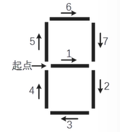
</div>

- 七段数码管由 7 个基本线条组成
- 七段数码管可以有固定顺序
- 不同数字显示不同的线条

### 第 5 章 第 3 节: 代码复用与函数递归

#### 代码复用

把代码当成资源进行抽象.函数和对象是代码复用的两种主要形式.

- 代码资源化:程序代码是一种用来表达计算的"资源".
- 代码抽象化:使用函数等方法对代码赋予更高级别的定义.
- 代码复用:同一份代码在需要时可以被重复使用.
- 函数:将代码命名,在代码层面建立了初步抽象.
- 对象:属性和方法 `<a>.<b>` 和 `<a>.<b>0` 在函数之上再次组织进行抽象,分而治之.
- 通过函数或对象封装将程序划分为模块及模块间的表达,具体包括:主程序,子程序和子程序间关系.
- 分而治之:一种分而治之,分层抽象,体系化的设计思想.

#### 紧耦合松耦合

- 紧耦合:两个部分之间交流很多,无法独立存在.
- 松耦合:两个部分之间交流较少,可以独立存在.
- 模块内部紧耦合,模块之间松耦合.

#### 函数递归

- 链条:计算过程存在递归链条.
- 基例:存在一个或多个不需要再次递归的基例,类似数学归纳法.

#### 数学归纳法

- 证明当 n 取第一个值 n₀ 时命题成立.
- 假设当 n=k 时命题成立,证明当 n=k+1 时命题也成立.
- 递归是数学归纳法思维的编程体现.

将字符串 s 反转后输出:

```python
>>> s[::-1]
```

函数+分支结构

- 递归链条
- 递归基例

```python
def rvs(s):
    if s == "":
        return s
    else:
        return rvs(s[1:]) + s[0]
```

#### 单元小结

模块化设计:松耦合,紧耦合
函数递归的 2 个特征:基例和链条
函数递归的 2 个特征:基例和链条

### 第 5 章第 4 节: PyInstaller 的使用

使用命令行(cmd)打包 Python 文件:

    pyinstaller -F <文件名.py>

参数选项及其描述:

| 参数                 | 描述                                 |
| -------------------- | ------------------------------------ |
| `-h`                 | 查看帮助                             |
| `--clean`            | 清理打包过程中的临时文件             |
| `-D`, `--onedir`     | 默认值,生成 dist 文件夹              |
| `-F`, `--onefile`    | 在 dist 文件夹中只生成独立的打包文件 |
| `-i<图标文件名.ico>` | 指定打包程序使用的图标(icon)文件     |

<div align="center">
    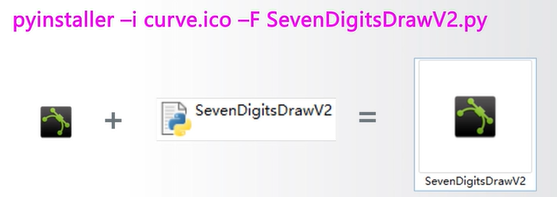
</div>

#### 高大上的分形几何

- 分形几何是一种迭代的几何图形,广泛存在于自然界中
- 科赫曲线,也叫雪花曲线
- 递归思想:函数+分支
  - 递归链条:线段的组合
  - 递归基例:初识线段
- 绘制条件的扩展
  - 修改分形几何绘制阶数
  - 修改科赫曲线的基本定义及旋转角度
  - 修改绘制科赫雪花的基础框架图形

#### 分形几何干干万

- 康托尔集,谢尔宾斯基三角形,门格海绵.
- 龙形曲线,空间填充曲线,科赫曲线..
- 函数递归的深入应用.

### 第 6 周: 组合数据类型

#### 第 6 周课程导学

##### 第 3 周

###### 数字类型及操作

- 整数类型的无限范围及 4 种进制表示
- 浮点数类型的近似无限范围,小尾数及科学计数法
- 操作符: `+`, `-`, `*`, `/`, `//`, `%`, `**` 以及二元增强赋值操作符
- 函数: `abs()`, `divmod()`, `pow()`, `round()`, `max()`, `min()`
- 类型转换: `int()`, `float()`, `complex()`

###### 字符串类型及操作

- 正向递增序号,反向递减序号,`<字符串>[M:N:K]`
- 操作符: `+`, `*` 以及函数 `len()`, `str()`, `hex()`, `oct()`, `ord()`, `chr()`
- 方法: `.lower()`, `.upper()`, `.split()`, `.count()`, `.replace()`
- 方法: `.center()`, `.strip()`, `join()`, `format()` 格式化
- 程序的分支结构

##### 第 4 周

###### 程序的分支结构

- 单分支 `if`,二分支 `if-else` 及紧凑形式
- 多分支 `if-elif-else` 及条件之间的关系
- 逻辑运算符: `not`, `and`, `or`, `>`, `>=`, `<`, `<=`, `!=`
- 异常处理 `try-except-else-finally`

###### 程序的循环结构

- `for...in` 遍历循环:计数,字符串,列表,文件等
- `while` 无限循环
- 保留字 `continue` 和 `break`:退出当前循环层次
- 循环 `else` 的高级用法:与 `break` 有关

##### 第 5 周

###### 函数的定义与使用

- 使用保留字 `def` 定义函数,`lambda` 定义匿名函数
- 可选参数(赋初值),可变参数(`*b`),名称传递
- 保留字 `return` 可以返回任意多个结果
- 保留字 `global` 声明使用全局变量,一些隐式规则

###### 代码复用与函数递归

- 模块化设计:松耦合,紧耦合
- 函数递归的 2 个特征:基例和链条
- 函数递归的实现:函数+分支结构

## 第 6 章 组合数据类型

### 6.1 集合类型及操作

### 6.2 序列类型及操作

- 列表类型
- 元组类型

### 6.3 实例 9:基本统计值计算

### 6.4 字典类型及操作

### 6.5 模块 5: jieba 库的使用

### 6.6 实例 10:文本词频统计

### 方法论

- Python 三种主流组合数据类型的使用方法

#### 实践能力

- 学会编写处理一组数据的程序

### 第 6 章第 1 节: 集合类型及操作

- 集合类型定义
- 集合操作符
- 集合处理方法
- 集合类型应用场景

#### 集合类型的定义

集合是多个元素的无序组合.集合类型与数学中的集合概念一致:

- 集合元素之间无序,每个元素唯一,不存在相同元素.
- 集合元素不可更改,不能是可变数据类型.为什么?因为集合是多个元素的无序组合.

集合用大括号{}表示,元素间用逗号分隔:

- 建立集合类型用{}或`set()`
- 建立空集合类型,必须使用`set()`

```python
A = {"python", 123, ("python", 123)} # 使用{}建立集合
# 输出: {123, 'python', ('python', 123)}
B = set("pypy123") # 使用set()建立集合
# 输出: {'1', 'p', '2', '3', 'y'}
C = {"python", 123, "python", 123}
# 输出: {'python', 123}

```

#### 重点

- 集合用大括号表示,元素间用逗号分隔
- 集合中每个元素唯一,不存在相同元素
- 集合元素之间无序

#### 集合操作符

- 6 个操作符
  | 操作符及应用 | 描述 |
  | --- | --- |
  | `S | T` | 返回一个新集合,包括在集合 S 和 T 中的所有元素 |
  | `S - T` | 返回一个新集合,包括在集合 S 但不在 T 中的元素 |
  | `S & T` | 返回一个新集合,包括同时在集合 S 和 T 中的元素 |
  | `S ^ T` | 返回一个新集合,包括集合 S 和 T 中的非相同元素 |
  | `S <= T` 或 `S < T` | 返回 True/False,判断 S 和 T 的子集关系 |
  | `S >= T` 或 `S > T` | 返回 True/False,判断 S 和 T 的包含关系 |

- 4 个增强操作符
  | 操作符及应用 | 描述 |
  | --- | --- |
  | `S |= T` | 更新集合 S,包括在集合 S 和 T 中的所有元素 |
  | `S -= T` | 更新集合 S,包括在集合 S 但不在 T 中的元素 |
  | `S &= T` | 更新集合 S,包括同时在集合 S 和 T 中的元素 |
  | `S ^= T` | 更新集合 S,包括集合 S 和 T 中的非相同元素 |

```python
A = {"p", "y", 123}
B = set("pypy123")
print(A - B)   # {123}
print(A & B)   # {'p', 'y'}
print(A ^ B)   # {'2', 123, '3', '1'}
print(B - A)   # {'3', '1', '2'}
print(A | B)   # {'1', 'p', '2', 'y', '3', 123}
```

#### 集合处理方法

- 操作函数或方法
  | 操作函数或方法 | 描述 |
  | --- | --- |
  | `S.add(x)` | 如果 x 不在集合 S 中,将 x 增加到 S |
  | `S.discard(x)` | 移除 S 中元素 x,如果 x 不在集合 S 中,不报错 |
  | `S.remove(x)` | 移除 S 中元素 x,如果 x 不在集合 S 中,产生 KeyError 异常 |
  | `S.clear()` | 移除 S 中所有元素 |
  | `S.pop()` | 随机返回 S 的一个元素,更新 S,若 S 为空产生 KeyError 异常 |

- 更多操作
  | 操作函数或方法 | 描述 |
  | --- | --- |
  | `S.copy()` | 返回集合 S 的一个副本 |
  | `len(S)` | 返回集合 S 的元素个数 |
  | `x in S` | 判断 S 中元素 x,如果 x 在集合 S 中,返回 True,否则返回 False |
  | `x not in S` | 判断 S 中元素 x,如果 x 不在集合 S 中,返回 True,否则返回 False |
  | `set(x)` | 将其他类型变量 x 转变为集合类型 |

```python
A = {"p", "y", 123}
for item in A:
    print(item, end="")
# 输出: p123y 或其他顺序,因为集合是无序的
print(A)
# 输出: {'p', 123, 'y'} 或其他顺序

try:
    while True:
        print(A.pop(), end="")
except:
    pass
# 输出: p123y 或其他顺序
print(A)
# 输出: set()
```

#### 集合类型应用场景

- 包含关系比较

```python
print("p" in {"p", "y", 123})  # 输出: True
print({"p", "y"} >= {"p", "y", 123})  # 输出: False
```

- 数据去重:集合类型所有元素无重复

```python
ls = ["p", "p", "y", "y", 123]
s = set(ls)  # 利用了集合无重复元素的特点
print(s)  # 输出: {'p', 'y', 123}
lt = list(s)  # 将集合转换为列表
print(lt)  # 输出: ['p', 'y', 123] 或其他顺序
```

#### 单元小结

#### 集合类型及操作

- 集合的创建和使用:

  - 使用 `{}` 或 `set()` 函数创建集合.

- 集合间操作:

  - 交集:`S & T`
  - 并集:`S | T`
  - 差集:`S - T`
  - 对称差集(补集):`S ^ T`
  - 子集和超集比较:`S <= T`,`S < T`,`S >= T`,`S > T`

- 集合类型方法:

  - `.add()`:添加元素到集合
  - `.discard()`:移除集合中的指定元素,如果元素不存在,则不进行任何操作
  - `.pop()`:随机移除一个元素并返回它

- 集合类型的主要应用:
  - 包含关系比较:检查一个集合是否是另一个集合的子集或超集
  - 数据去重:利用集合元素的唯一性去除重复元素

### 第 6 章第 2 节: 序列类型及操作

- 序列类型定义
- 序列处理函数及方法
- 元组类型及操作
- 列表类型及操作
- 序列类型应用场景

#### 序列类型定义

序列是具有先后关系的一组元素

- 序列是一维元素向量,元素类型可以不同
- 类似数学元素序列:
  $$S _ { 0 } , S _ { 1 } , . . . , S _ { n - 1 } , S _ { n } $$
- 元素间由序号引导,通过下标访问序列的特定元素

#### 序列类型通用操作符

- 6 个操作符
  | 操作符及应用 | 描述 |
  | --- | --- |
  | `x in s` | 如果 x 是序列 s 的元素,返回 True,否则返回 False |
  | `x not in s` | 如果 x 是序列 s 的元素,返回 False,否则返回 True |
  | `s + t` | 连接两个序列 s 和 t |
  | `s * n` 或 `n * s` | 将序列 s 复制 n 次 |
  | `s[i]` | 索引,返回 s 中的第 i 个元素,i 是序列的序号 |
  | `s[i: j]` 或 `s[i: j: k]` | 切片,返回序列 s 中第 i 到 j 以 k 为步长的元素子序列 |

- 序列类型操作实例

```python
  ls = ["python", 123, ".io"]
  print(ls[::-1])  # 输出: ['.io', 123, 'python']
  s = "python123.io"
  print(s[::-1])  # 输出: 'oi.321nohtyp'
```

#### 序列类型通用函数和方法

- 5 个函数和方法
  | 函数和方法 | 描述 |
  | --- | --- |
  | `len(s)` | 返回序列 s 的长度 |
  | `min(s)` | 返回序列 s 的最小元素,s 中元素需要可比较 |
  | `max(s)` | 返回序列 s 的最大元素,s 中元素需要可比较 |
  | `s.index(x)` 或 `s.index(x, i)` | 返回序列 s 从 i 开始到末尾中第一次出现元素 x 的位置 |
  | `s.count(x)` | 返回序列 s 中出现 x 的总次数 |

- 序列类型操作实例

```python
ls = ["python", 123, ".io"]
print(len(ls))  # 输出: 3
s = "python123.io"
print(max(s))  # 输出: 'y'
```

#### 元组类型及操作

#### 元组类型定义

元组是序列类型的一种扩展:

- 元组是一种序列类型,一旦创建就不能被修改.
- 使用小括号 `()` 或 `tuple()` 创建,元素间用逗号 `,` 分隔.
- 可以使用或不使用小括号.

```python
def func():
    return 1, 2

creature = "cat", "dog", "tiger", "human"
print(creature)  # 输出: ('cat', 'dog', 'tiger', 'human')

color = (0x001100, "blue", creature)
print(color)  # 输出: (4352, 'blue', ('cat', 'dog', 'tiger', 'human'))
```

#### 元组类型操作

元组继承了序列类型的全部通用操作,但因为创建后不能修改,所以没有特殊的操作方法.

- 使用或不使用小括号.

示例代码:

```python
creature = "cat", "dog", "tiger", "human"
print(creature[::-1])  # 输出: ('human', 'tiger', 'dog', 'cat')

color = (0x001100, "blue", creature)
print(color[-1][2])  # 输出: 'tiger'
```

#### 列表类型定义

列表是序列类型的一种扩展,十分常用 -列表是一种序列类型,创建后可以随意被修改
一使用方括号或 list() 创建,元素间用逗号,分隔 -列表中各元素类型可以不同,无长度限制

```python
ls =["cat","dog","tiger", 1024]
ls
['cat','dog','tiger',1024]
lt = ls  # 方括号真正创建一个列表,赋值仅传递引用
lt
['cat','dog','tiger',1024]
```

#### 列表类型操作函数和方法

| 函数或方法         | 描述                                        |
| ------------------ | ------------------------------------------- |
| `ls[i]= x`         | 替换列表 ls 第 i 元素为 x                   |
| `ls[i: j: k] = lt` | 用列表 lt 替换 ls 切片后所对应元素子列表    |
| `del ls[i]`        | 删除列表 ls 中第 i 元素                     |
| `del ls[i: j: k]`  | 删除列表 ls 中第 i 到第 j 以 k 为步长的元素 |
| `ls += lt`         | 更新列表 ls,将列表 lt 元素增加到列表 ls 中  |
| `ls *= n`          | 更新列表 ls,其元素重复 n 次                 |

列表类型操作

```python
ls = ["cat","dog","tiger",1024]
ls[1:2] = [1,2,3,4]  # ['cat',1,2,3,4,'tiger',1024]
del ls[::3]  # [1,2,4,'tiger']
ls*2  # [1,2,4,'tiger',1,2,4,'tiger']
```

#### 列表类型操作函数和方法

| 函数或方法       | 描述                                      |
| ---------------- | ----------------------------------------- |
| `ls.append(x)`   | 在列表 ls 最后增加一个元素 x              |
| `ls.clear()`     | 删除列表 ls 中所有元素                    |
| `ls.copy()`      | 生成一个新列表,赋值 ls 中所有元素         |
| `ls.insert(i,x)` | 在列表 ls 的第 i 位置增加元素 x           |
| `ls.pop(i)`      | 将列表 ls 中第 i 位置元素取出并删除该元素 |
| `ls.remove(x)`   | 将列表 ls 中出现的第一个元素 x 删除       |
| `ls.reverse()`   | 将列表 ls 中的元素反转                    |

```python
ls =["cat","dog","tiger",1024]
ls.append(1234)  # ['cat','dog','tiger',1024,1234]
ls.insert(3,"human")  # ['cat','dog','tiger','human',1024,1234]
ls.reverse()  # [1234,1024,'human','tiger','dog','cat']
```

#### 列表功能

| 功能                            | 代码示例                     | 结果                    |
| ------------------------------- | ---------------------------- | ----------------------- |
| 定义空列表 lt                   | `lt = []`                    | `[]`                    |
| 判断 lt 中是否包含数字 0        | `0 in lt`                    | `False`                 |
| 向 lt 新增 5 个元素             | `lt.extend([1, 2, 3, 4, 5])` | `[1, 2, 3, 4, 5]`       |
| 向 lt 新增数字 0                | `lt.append(0)`               | `[1, 2, 3, 4, 5, 0]`    |
| 修改 lt 中第 2 个元素           | `lt[1] = 7`                  | `[1, 7, 3, 4, 5, 0]`    |
| 返回数字 0 所在 lt 中的索引     | `lt.index(0)`                | `5`                     |
| 向 lt 中第 2 个位置增加一个元素 | `lt.insert(1, 8)`            | `[1, 8, 7, 3, 4, 5, 0]` |
| lt 的长度                       | `len(lt)`                    | `7`                     |
| 从 lt 中第 1 个位置删除一个元素 | `lt.pop(0)`                  | `[8, 7, 3, 4, 5, 0]`    |
| lt 中最大元素                   | `max(lt)`                    | `8`                     |
| 删除 lt 中第 1-3 位置元素       | `del lt[0:3]`                | `[4, 5, 0]`             |
| 清空 lt                         | `lt.clear()`                 | `[]`                    |

#### 序列类型应用场景

序列包含元组,列表两种重要的扩展类型
序列类型应用场景

- 元组用于元素不改变的应用场景,更多用于固定搭配场景
- 列表更加灵活,它是最常用的序列类型
- 最主要作用:表示一组有序数据,进而操作它们

元素遍历

```python
for item in ls :
    <语句块>
for item in tp :
    <语句块>
```

#### 数据保护

- 如果不希望数据被程序所改变,转换成元组类型

```python
ls = ["cat", "dog", "tiger",1024]
lt = tuple(ls)
print(lt)  # 输出: ('cat', 'dog', 'tiger', 1024)
```

#### 单元小结

- 序列是基类类型,扩展类型包括:字符串,元组和列表
- 元组用()和 tuple()创建,列表用[]和 list()创建
- 元组操作与序列操作基本相同

### 第 6 章第 3 节:基本统计值计算

问题分析基本统计值

- 总个数: `len()`
- 求和: `for ... in`
- 平均值: 求和/总个数
- 方差: 各数据与平均数差的平方的和的平均数
- 中位数: 排序,然后...奇数找中间 1 个,偶数找中间 2 个取平均

#### 技术能力扩展

- 获取多个数据:从控制台获取多个不确定数据的方法
- 分隔多个函数:模块化设计方法
- 充分利用函数:充分利用 Python 提供的内容函数

### 第 6 章第 4 节:字典类型及操作

- 字典类型定义
- 字典处理函数及方法
- 字典类型应用场景

#### 理解"映射"

- 映射是一种键(索引)和值(数据)的对应

```python
{
    "streetAddr": "中关村南大街5号",
    "city": "北京市",
    "zipcode": "100081"
}
```

#### 理解"映射"

- 映射是一种键(索引)和值(数据)的对应

```python
["python", 123,".io"]  # 索引: 0 1 2
```

- 序列类型由 0.N 整数作为数据的默认索引
- 映射类型则由用户为数据定义索引

#### 字典类型的用法

在字典变量中,通过键获得值

```python
<字典变量> = {<键1>:<值1>, ..., <键n>:<值n>}
<值> = <字典变量>[<键>]
<字典变量>[<键>] = <值>
```

`[]`用来向字典变量中索引或增加元素.
示例:

```python
d = {"中国": "北京", "美国": "华盛顿", "法国": "巴黎"}
print(d)
# 输出: {"中国": "北京", "美国": "华盛顿", "法国": "巴黎"}

print(d["中国"])
# 输出: 北京

d_empty = {}
print(type(d_empty))
# 输出: <class 'dict'>
```

`type(x) `返回变量 x 的类型.

#### 字典类型操作函数和方法

| 函数或方法   | 描述                                                    |
| ------------ | ------------------------------------------------------- |
| `del d[k]`   | 删除字典 d 中键 k 对应的数据值                          |
| `k in d`     | 判断键 k 是否在字典 d 中,如果在返回 True,否则返回 False |
| `d.keys()`   | 返回字典 d 中所有的键信息                               |
| `d.values()` | 返回字典 d 中所有的值信息                               |
| `d.items()`  | 返回字典 d 中所有的键值对信息                           |

示例:

```python
d = {"中国": "北京", "美国": "华盛顿", "法国": "巴黎"}
print("中国" in d)
# 输出: True

print(d.keys())
# 输出: dict_keys(['中国', '美国', '法国'])

print(d.values())
# 输出: dict_values(['北京', '华盛顿', '巴黎'])
```

| 函数或方法            | 描述                                         |
| --------------------- | -------------------------------------------- |
| `d.get(k, <default>)` | 键 k 存在,则返回相应值,不在则返回<default>值 |
| `d.pop(k, <default>)` | 键 k 存在,则取出相应值,不在则返回<default>值 |
| `d.popitem()`         | 随机从字典 d 中取出一个键值对,以元组形式返回 |
| `d.clear()`           | 删除所有的键值对                             |
| `len(d)`              | 返回字典 d 中元素的个数                      |

示例:

```python
d = {"中国": "北京", "美国": "华盛顿", "法国": "巴黎"}
print(d.get("中国", "伊斯兰堡"))
# 输出: 北京

print(d.get("巴基斯坦", "伊斯兰堡"))
# 输出: 伊斯兰堡

print(d.popitem())
# 输出: ('美国', '华盛顿')

```

#### 小结

- 定义空字典 d
- 向 d 新增 2 个键值对元素
- 修改第 2 个元素
- 判断字符"c"是否是 d 的键
- 计算 d 的长度
- 清空 d

示例:

```python
# 定义空字典d
d = {}

# 向d新增2个键值对元素
d["a"] = "value1"
d["b"] = "value2"

# 修改第2个元素
d["b"] = "new_value2"

# 判断字符"c"是否是d的键
print("c" in d)  # 输出: False

# 计算d的长度
print(len(d))  # 输出: 2

# 清空d
d.clear()
```

#### 字典类型应用场景

映射的表达

- 映射无处不在,键值对无处不在
- 例如:统计数据出现的次数,数据是键,次数是值
- 最主要作用:表达键值对数据,进而操作它们
  元素遍历

```python
for k in d :
    <语句块>
```

#### 单元小结

映射关系采用键值对表达

- 字典类型使用 0 和 dict()创建,键值对之间用:分隔
- d[key]方式既可以索引,也可以赋值
- 字典类型有一批操作方法和函数,最重要的是.get()

### 第 6 章第 5 节:jieba 库的使用

jieba 是优秀的中文分词第三方库

- 中文文本需要通过分词获得单个的词语
- jieba 是优秀的中文分词第三方库,需要额外安装
- jieba 库提供三种分词模式,最简单只需掌握一个函数

Jieba 分词依靠中文词库

- 利用一个中文词库,确定汉字之间的关联概率
- 汉字间概率大的组成词组,形成分词结果
- 除了分词,用户还可以添加自定义的词组

#### jieba 分词的三种模式

精确模式,全模式,搜索引擎模式

- 精确模式:把文本精确的切分开,不存在亢余单词
- 全模式:把文本中所有可能的词语都扫描出来,有余
- 搜索引擎模式:在精确模式基础上,对长词再次切分

| 函数            | 描述                                |
| --------------- | ----------------------------------- |
| `jieba.lcut(s)` | 精确模式,返回一个列表类型的分词结果 |

示例:`jieba.lcut("中国是一个伟大的国家")` 输出:["中国", "是", "一个", "伟大", "的", "国家"]

`jieba.lcut(s, cut_all=True)` | 全模式,返回一个列表类型的分词结果,存在冗余
示例:`jieba.lcut("中国是一个伟大的国家", cut_all=True)` 输出:["中国", "国是", "一个", "伟大", "的", "国家"]

| 函数                       | 描述                                             |
| -------------------------- | ------------------------------------------------ |
| `jieba.lcut_for_search(s)` | 搜索引擎模式,返回一个列表类型的分词结果,存在冗余 |

示例:`jieba.lcut_for_search("中华人民共和国是伟大的")` 输出:["中华", "华人", "人民", "共和", "共和国", "中华人民共和国", "是", "伟大", "的"]

`jieba.add_word(w)` | 向分词词典增加新词 w
示例:`jieba.add_word("蟒蛇语言")`

#### 要点

jieba.lcut(s)

### 第 6 章第 6 节"文本词频统计"

#### 文本词频统计

需求:一篇文章,出现了哪些词?哪些词出现得最多?

- 该怎么做呢?

#### 英文文本

- 文本词频统计
  - 英文文本:<Hamlet>分析词频
  - 文本来源:[Hamlet Text](https://python123.io/resources/pye/hamlet.txt)

#### 中文文本

- 文本词频统计
  - 中文文本:<三国演义>分析人物
  - 文本来源:[三国演义 Text](https://python123.io/resources/pye/threekingdoms.txt)

## 第 7 章文件和数据格式化

### 课程导学

数字类型及操作

- 整数类型的无限范围及 4 种进制表示
- 浮点数类型的近似无限范围,小尾数及科学计数法
- +,-,\*,/,1/,%,\*\*,二元增强赋值操作符
- abs(),divmod(),pow(),round(),max(),min()
- int(),float(),complex()

字符串类型及操作

- 正向递增序号,反向递减序号,<字符串>[M:N:K]
- +,\*,len(),str(),hex(),oct(),ord(),chr()
- .lower(),.upper(),.split(),.count(),.replace()
- .center(),.strip(),join(),.format()格式化

程序的分支结构

- 单分支 if 二分支 if-else 及紧凑形式
- 多分支 if-eiif-else 及条件之间关系
- not and or > ==
- 异常处理 try-except-else-finally

程序的循环结构

- for...in 遍历循环:计数,字符串,列表,文件...
- while 无限循环
- continue 和 break 保留字:退出当前循环层次
- 循环 e1se 的高级用法:与 break 有关

函数的定义与使用

- 使用保留字 def 定义函数,1ambda 定义匿名函数
- 可选参数(赋初值),可变参数(\*b),名称传递
- 保留字 return 可以返回任意多个结果
- 保留字 globa1 声明使用全局变量,一些隐式规则

代码复用与函数递归

- 模块化设计:松耦合,紧耦合
- 函数递归的 2 个特征:基例和链条
- 函数递归的实现:函数＋分支结构

集合类型及操作

- 集合使用 0 和 setO 函数创建
- 集合间操作:交(&),并(I),差(-),补(^),比较(>=<)
- 集合类型方法:.addO,.discardO,.popO 等
- 集合类型主要应用于:包含关系比较,数据去重

序列类型及操作

- 列是基类类型护展类型包括:字符串,元组和列表
- 元组用()和 tuple()创建,列表用和 list()创建
- 元组操作与序列操作基本相同
- 列表操作在序列操作基础上,增加了更多的灵活性

字典类型及操作

- 映射关系采用键值对表达
- 字典类型使用()和 dict()创建,键值对之间用:分隔
- d[key]方式既可以索引,也可以赋值
- 字典类型有一批操作方法和函数,最重要的是.get()

<div align="center">
    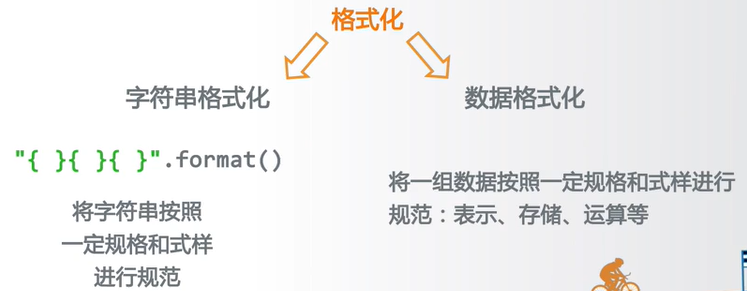
</div>

### 第 7 章第 1 节:文件的使用

#### 文件的类型

文件是数据的抽象和集合

- 文件是存储在辅助存储器上的数据序列
- 文件是数据存储的一种形式
- 文件展现形态:文本文件和二进制文件

文本文件 vs.二进制文件

- 文件文件和二进制文件只是文件的展示方式
- 本质上,所有文件都是二进制形式存储
- 形式上,所有文件采用两种方式展示

文件是数据的抽象和集合

- 由单一特定编码组成的文件,如 UTF-8 编码
- 由于存在编码,也被看成是存储着的长字符串
- 适用于例如:.txt 文件,.py 文件

文件是数据的抽象和集合

- 直接由比特 0 和 1 组成,没有统一字符编码
- 一般存在二进制 0 和 1 的组织结构,即文件格式
- 适用于例如:.png 文件,.avi 文件等

"中国是个伟大的国家!"

- 文本形式
  中国是个伟大的国家!

- 二进制形式
  b'\xe4\xb8\xad\xe5\x9b\xbd\xe6\x98\xaf\xe4\xb8\xaa\xe4\xbc\x9f\xe5\xa4\xa7\xe7\x9a\x84\xe5\x9b\xbd\xe5\xae\xb6\xef\xbc\x81'

f.txt 文件保存:"中国是个伟大的国家!"

```python
# 文本形式打开文件
tf = open("f.txt", "rt")
print(tf.readline())
tf.close()
# 输出:中国是个伟大的国家!
```

f.txt 文件保存:"中国是个伟大的国家!"

```python
# 二进制形式打开文件
bf = open("f.txt", "rb")
print(bf.readline())
bf.close()
# 输出:
b'\xe4\xb8\xad\xe5\x9b\xbd\xe6\x98\xaf\xe4\xb8\xaa\xe4\xbc\x9f\xe5\xa4\xa7\xe7\x9a\x84\xe5\x9b\xbd\xe5\xae\xb6\xef\xbc\x81'
```

#### 文件的打开关闭

- 文件处理的步骤:打开-操作-关闭

<div align="center">
    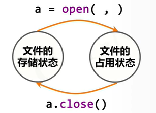
</div>

读文件

- a.read(size)
- a.readline(size)
- a.readlines(hint)

读文件

- a.write(s)
- a.writelines(lines)
- a.seek(offset)

<div align="center">
    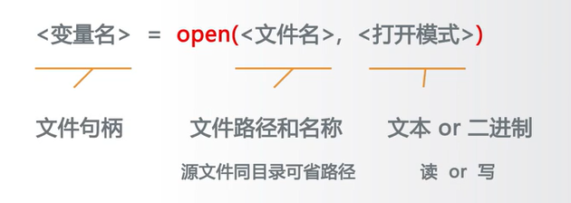
</div>

<div align="center">
    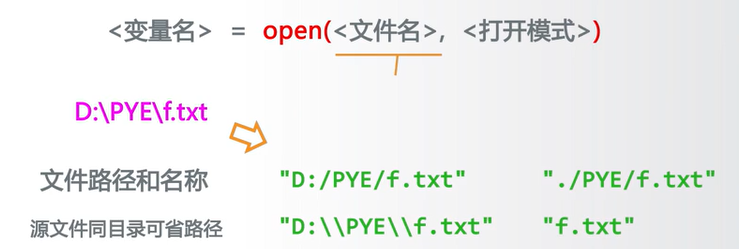
</div>

| 文件打开模式 | 描述                                                                 |
| ------------ | -------------------------------------------------------------------- |
| 'r'          | 只读模式,默认值.如果文件不存在,返回 FileNotFoundError.               |
| 'w'          | 覆盖写模式,文件不存在则创建,存在则完全覆盖.                          |
| 'x'          | 创建写模式,文件不存在则创建,存在则返回 FileExistsError.              |
| 'a'          | 追加写模式,文件不存在则创建,存在则在文件最后追加内容.                |
| 'b'          | 二进制文件模式,与其他模式一同使用(如 'rb', 'wb')用于读/写二进制文件. |
| '+'          | 与 r/w/x/a 一同使用,在原功能基础上增加同时读写功能(如 'r+', 'w+').   |

| 调用方式                  | 描述                       |
| ------------------------- | -------------------------- |
| `f = open("f.txt")`       | 文本形式,只读模式,默认值   |
| `f = open("f.txt", "rt")` | 文本形式,只读模式,同默认值 |
| `f = open("f.txt", "w")`  | 文本形式,覆盖写模式        |
| `f = open("f.txt", "a+")` | 文本形式,追加写模式+读文件 |
| `f = open("f.txt", "x")`  | 文本形式,创建写模式        |
| `f = open("f.txt", "rb")` | 二进制形式,只读模式        |

文件的关闭:

使用 `<变量名>.close()` 来关闭文件,确保释放系统资源.

示例:

```python
# 文本形式打开文件
tf = open("f.txt", "rt")
print(tf.readline())
tf.close()

# 二进制形式打开文件
bf = open("f.txt", "rb")
print(bf.readline())
bf.close()
```

#### 文件内容的读取

| 操作方法                 | 描述                                                                                                                       |
| ------------------------ | -------------------------------------------------------------------------------------------------------------------------- |
| `<f>.read(size=-1)`      | 读入全部内容,如果给出参数,读入前 size 长度.例如:`s = f.read(2)` 结果: `中国`                                               |
| `<f>.readline(size=-1)`  | 读入一行内容,如果给出参数,读入该行前 size 长度.例如:`s = f.readline()` 结果: `中国是一个伟大的国家!`                       |
| `<f>.readlines(hint=-1)` | 读入文件所有行,以每行为元素形成列表.如果给出参数,读入前 hint 行.例如:`s = f.readlines()` 结果: `["中国是一个伟大的国家!"]` |

#### 遍历全文本

##### 方法一

- 一次读入, 统一处理

```python
fname = input("请输入要打开的文件名称:")
fo = open(fname, "r")
txt = fo.read()
# 对全文txt进行处理
fo.close()
```

###### 方法二

- 按数量读入,逐步处理

```python
fname = input("请输入要打开的文件名称:")
fo = open(fname, "r")
txt = fo.read(2)
while txt != "":
    # 对txt进行处理
    txt = fo.read(2)
fo.close()
```

#### 逐行遍历文件

##### 方法一

- 一次读入,分行处理

```python
fname = input("请输入要打开的文件名称:")
fo = open(fname, "r")
for line in fo.readlines():
    print(line)
fo.close()
```

##### 方法二

- 分行读入,逐行处理

```python
fname = input("请输入要打开的文件名称:")
fo = open(fname, "r")
for line in fo:
    print(line)
fo.close()

```

#### 数据文件写入

| 操作方法                | 描述                                                                                                                     |
| ----------------------- | ------------------------------------------------------------------------------------------------------------------------ |
| `<f>.write(s)`          | 向文件写入一个字符串或字节流.例如:`f.write("中国是一个伟大的国家!")`                                                     |
| `<f>.writelines(lines)` | 将一个元素全为字符串的列表写入文件.例如:<br>`ls = ["中国", "法国", "美国"]`<br>`f.writelines(ls)`<br>结果:`中国法国美国` |
| `<f>.seek(offset)`      | 改变当前文件操作指针的位置,`offset`含义如下:<br>0－文件开头;1－当前位置;2-文件结尾.<br>例如:`f.seek(0)`(回到文件开头)    |

```python
fo = open("output.txt", "w+")
ls = ["中国", "法国", "美国"]
fo.writelines(ls)
fo.seek(0)  # 回到文件开头,以便读取
for line in fo:
    print(line)  # 尝试读取写入的内容
fo.close()
```

#### 文件的使用

文件在程序中通常遵循以下使用方式:

1. **打开文件** - 使用 `open()` 函数打开文件.
2. **操作文件** - 读取或写入文件内容.
3. **关闭文件** - 使用 `.close()` 方法关闭文件以释放系统资源.

#### 文件类型

- **文本文件** - 包含可读的文本字符.
- **二进制文件** - 包含二进制数据,常用于图像,视频等数据.

#### 文件操作函数

- **打开与关闭**

  - `open(file, mode)` - 打开一个文件,`mode` 指定打开文件的模式(如 'r' 读模式,'w' 写模式).
  - `.close()` - 关闭一个打开的文件.

- **文件内容的读取**

  - `.read(size)` - 读取文件,如果提供 `size`,则读取指定数量的字符.
  - `.readline()` - 读取文件的一行.
  - `.readlines()` - 读取文件中的所有行,返回一个行的列表.

- **数据的文件写入**
  - `.write(string)` - 将字符串写入文件.
  - `.writelines(list)` - 将一个字符串列表写入文件,不自动添加任何换行符.
  - `.seek(offset, whence)` - 改变当前文件操作指针的位置,`offset` 指定要移动的字符数,`whence` 指定起始位置(0 - 文件开头;1 - 当前位置;2 - 文件结尾).

使用这些基础函数和方法,可以实现文件的基本读取和写入操作.

### 第 7 章第 2 节:自动轨迹绘制

自动轨迹绘制 -需求:根据脚本来绘制图形 -不是写代码(turtle)而是写数据绘制轨迹

<div align="center">
    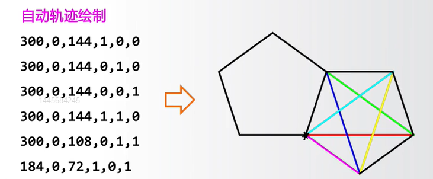
</div>

基本思路

- 步骤 1:定义数据文件格式(接口)
- 步骤 2:编写程序,根据文件接口解析参数绘制图形
- 步骤 3:编制数据文件

<div align="center">
    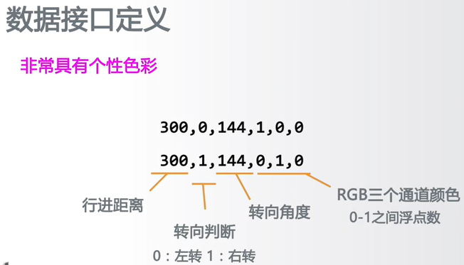
</div>

理解方法思维

- 自动化思维:数据和功能分离,数据驱动的自动运行
- 接口化设计:格式化设计接口,清晰明了
- 二维数据应用:应用维度组织数据,二维数据最常用

应用问题的扩展

- 扩展接口设计,增加更多控制接口
- 扩展功能设计,增加弧形等更多功能
- 扩展应用需求,发展自动轨迹绘制到动画绘制

### 第 7 章第 3 节:一维数据的格式化

#### 一维数据

由对等关系的有序或无序数据构成,采用线性方式组织

- 3.1413,3.1398,3.1404,3.1401,3.1349,3.1376
- 对应列表,数组和集合等概念

如果数据间有序:使用列表类型

- ls=[3.1398,3.1349,3.1376]
- 列表类型可以表达一维有序数据
- for 循环可以遍历数据,进而对每个数据进行处理

如果数据间无序:使用集合类型

- st = {3.1398,3.1349,3.1376}
- 集合类型可以表达一维无序数据
- for 循环可以遍历数据,进而对每个数据进行处理

#### 一维数据的存储

存储方式一:空格分隔
中国 美国 日本 德国 法国 英国 意大利

- 使用一个或多个空格分隔进行存储,不换行
- 缺点:数据中不能存在空格

存储方式二:逗号分隔
中国,美国,日本,德国,法国,英国,意大利

- 使用英文半角逗号分隔数据进行存储,不换行
- 缺点:数据中不能有英文逗号

存储方式三:其他方式
中国$美国$日本$德国$法国$英国$意大利

- 使用其他符号或符号组合分隔,建议采用特殊符号
- 缺点:需要根据数据特点定义,通用性较差
  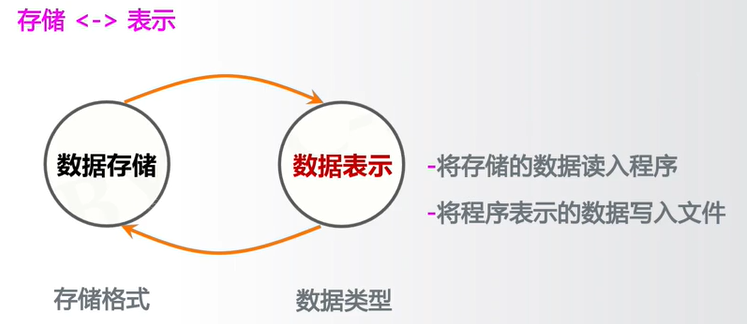

要从一个空格分隔的文件中读取数据,可以按照以下步骤进行:

1. 打开文件并读取内容.
2. 使用`split()`方法将字符串分割成单独的单词.
3. 将分割后的单词存储在列表中.
4. 关闭文件.

以下是 Python 代码示例:

```python
# 打开文件
txt = open(fname).read()

# 使用split()方法按空格分割字符串,存储在列表ls中
ls = txt.split()

# 关闭文件(如果使用了open()方法打开文件)
# f.close()

# 打印列表,查看结果
print(ls)  # 输出: ['中国', '美国', '日本', '德国', '法国', '英国', '意大利']
```

要从一个以特定符号(例如 '$')分隔的文件中读取数据,可以遵循以下步骤:

1. 打开文件并读取内容.
2. 使用`split("$")`方法按特定符号分割字符串,此处为 '$'.
3. 将分割后的单词存储在列表中.
4. 关闭文件.

以下是 Python 代码示例:

```python
# 打开文件
txt = open(fname).read()

# 使用split("$")方法按 '$' 分割字符串,存储在列表ls中
ls = txt.split("$")

# 关闭文件(如果使用了open()方法打开文件)
# f.close()

# 打印列表,查看结果
print(ls)  # 输出: ['中国', '美国', '日本', '德国', '法国', '英国', '意大利']
```

要将数据列表采用空格分隔的方式写入文件,可以遵循以下步骤:

1. 打开文件准备写入.
2. 使用`join()`方法将列表中的元素通过空格连接成一个字符串.
3. 将得到的字符串写入文件.
4. 关闭文件.

以下是 Python 代码示例:

```python
# 准备数据列表
ls = ["中国", "美国", "日本"]

# 打开文件准备写入
f = open(fname, 'w')

# 使用空格将列表中的元素连接成一个字符串,并写入文件
f.write(' '.join(ls))

# 关闭文件
f.close()
```

要将数据列表采用特殊分隔符(例如'$')的方式写入文件,可以遵循以下步骤:

1. 打开文件准备写入.
2. 使用`join()`方法结合特殊分隔符将列表中的元素连接成一个字符串.
3. 将得到的字符串写入文件.
4. 关闭文件.

以下是 Python 代码示例:

```python
# 准备数据列表
ls = ["中国", "美国", "日本"]

# 打开文件准备写入
f = open(fname, 'w')

# 使用'$'将列表中的元素连接成一个字符串,并写入文件
f.write('$'.join(ls))

# 关闭文件
f.close()
```

#### 单元小结

在本单元中,我们探讨了数据的维度,表示,存储和处理方式,特别是针对一维数据的相关技术.具体内容包括:

- **数据的维度**:

  - 一维
  - 二维
  - 多维
  - 高维

- **一维数据的表示**:

  - 列表类型(有序)
  - 集合类型(无序)

- **一维数据的存储方式**:

  - 空格分隔
  - 逗号分隔
  - 特殊符号分隔

- **一维数据的处理方法**:
  - 字符串方法,如 `split()` 和 `join()`

### 第 7 章第 4 节:二位数据的格式化

#### 二维数据的表示

使用列表类型

- 列表类型可以表达二位数据
- 使用二维列表(列表元素是列表)

```python
[[3.1398,3.1349,3.1376],[3.1413,3.1404,3.1401]]
```

- 使用两层 for 循环遍历每个元素
- 外层列表中每个元素可以对应一行,也可以对应一列

数据维度是数据的组织形式,它定义了数据的结构和在空间中的排列方式.常见的数据维度包括一维数据和二维数据:

- **一维数据**:

  - **列表类型**(有序): 用方括号`[]`表示,数据元素之间有明确的顺序.
    - 示例: `[3.1398, 3.1349, 3.1376]`
  - **集合类型**(无序): 用大括号`{}`表示,数据元素之间没有明确的顺序.
    - 示例: `{3.1398, 3.1349, 3.1376}`

- **二维数据**:
  - **列表类型**: 用嵌套的方括号`[]`表示,可以理解为列表的列表,每个内部列表代表二维数据中的一行.
    - 示例:
      ```
      [
        [3.1398, 3.1349, 3.1376],
        [3.1413, 3.1404, 3.1401]
      ]
      ```

#### CSV 格式与二维数据的存储

CSV (Comma-Separated Values) 是一种国际通用的一维或二维数据存储格式,通常文件以`.csv`扩展名保存.CSV 格式的主要特点包括:

- **格式说明**:

  - 每行存储一个一维数据,数据项之间采用逗号(`,`)分隔,行之间不包含空行.
  - 可以由 Excel 和常用的文本编辑软件读取或保存为 CSV 文件.

- **示例**:

  - 表格形式的数据表示:

    | 城市 | 环比  | 同比  | 定基  |
    | ---- | ----- | ----- | ----- |
    | 北京 | 101.5 | 120.7 | 121.4 |
    | 上海 | 101.2 | 127.3 | 127.8 |
    | 广州 | 101.3 | 119.4 | 120.0 |
    | 深圳 | 102.0 | 140.0 | 145.5 |
    | 沈阳 | 100.0 | 101.4 | 101.6 |

  - 对应的 CSV 表示:

    ```
    城市,环比,同比,定基
    北京,101.5,120.7,121.4
    上海,101.2,127.3,127.8
    广州,101.3,119.4,120.0
    深圳,102.0,140.0,145.5
    沈阳,100.0,101.4,101.6
    ```

- **注意事项**:

  - 如果某个数据项缺失,相应位置的逗号仍需保留.
  - 二维数据的表头可以作为数据存储,也可以另行存储.
  - 逗号应使用英文半角逗号,并且逗号与数据项之间不添加额外空格.

- **数据存储的方向**:
  - 数据可以按行存储也可以按列存储,具体取决于程序的设计.
  - 一般的索引习惯是`ls[row][column]`,即先行后列.
  - 根据常见的习惯,外层列表的每个元素代表一行数据,因此数据通常按行存储.

#### 二维数据的处理

要从 CSV 格式的文件中读取数据,可以遵循以下步骤:

1. 打开文件以供读取.
2. 逐行读取文件内容.
3. 移除每行末尾的换行符 `\n`.
4. 使用`split(",")`方法按逗号分割每行的数据.
5. 将分割后的数据存储在列表中.
6. 关闭文件.

以下是 Python 代码示例:

```python
# 打开文件
fo = open(fname)

# 初始化一个空列表,用于存储解析后的数据
ls = []

# 逐行读取数据
for line in fo:
    # 移除行尾的换行符
    line = line.replace("\n", "")

    # 使用逗号分隔每行的数据,并将结果添加到列表ls中
    ls.append(line.split(","))

# 关闭文件
fo.close()

# 打印列表,查看结果
print(ls)
```

要将数据写入 CSV 格式的文件,可以遵循以下步骤:

1. 打开文件准备写入.
2. 遍历数据列表(假设是一个二维列表,其中每个内部列表代表 CSV 文件的一行).
3. 使用`join()`方法和逗号(`,`)将每行的数据连接成一个字符串.
4. 写入每行数据到文件,并在每行末尾添加换行符 `\n`.
5. 关闭文件.

以下是 Python 代码示例:

```python
# 准备二维数据列表
ls = [["数据1-1", "数据1-2", "数据1-3"], ["数据2-1", "数据2-2", "数据2-3"], ["数据3-1", "数据3-2", "数据3-3"]]

# 打开文件准备写入
f = open(fname, 'w')

# 遍历数据列表
for item in ls:
    # 使用逗号连接每行的数据,并写入文件
    f.write(','.join(item) + '\n')

# 关闭文件
f.close()
```

对于二维数据的处理,常常需要对每个元素进行逐一操作.这可以通过采用两层嵌套的循环来实现:外层循环遍历行,内层循环遍历每行中的列.下面是一个具体的示例:

- **问题描述**:

  - 给定一个二维列表(如二维数组),我们希望逐一访问并处理每个元素.

- **解决方案**:
  - 采用两层循环:外层循环遍历每一行,内层循环遍历每一行中的每一列.

以下是 Python 代码示例:

```python
# 准备二维数据列表
ls = [[1, 2], [3, 4], [5, 6]]

# 外层循环遍历每一行
for row in ls:
    # 内层循环遍历行中的每一列
    for column in row:
        # 打印或处理每一个元素
        print(column)
```

#### 单元小结

二维数据是一种常见的数据结构,特别是在数据分析和处理中.它通常表示为列表类型,其中每个元素本身也是一个列表.下面是二维数据的表示和处理方法的概述:

**二维数据的表示:**

- **列表类型**:二维数据可以表示为列表的列表.外层列表的每个元素代表一行,而每个内部列表代表该行的列.
- **CSV 格式**:在 CSV(Comma-Separated Values)格式中,二维数据的一维部分通过逗号分隔,不同的行则通过换行符分隔.

**二维数据的处理:**

- **遍历和处理**:可以通过嵌套的`for`循环来遍历和处理二维数据.外层循环遍历行,内层循环遍历列.
- **字符串处理**:可以使用`.split()`方法将字符串分割成列表(例如,将 CSV 格式的字符串分割成二维数组),使用`.join()`方法将列表连接成字符串(例如,将二维数组转换为 CSV 格式的字符串).

**示例代码**:

```python
# 二维数据示例
data = [
    ["城市", "环比", "同比", "定基"],
    ["北京", "101.5", "120.7", "121.4"],
    ["上海", "101.2", "127.3", "127.8"]
]

# 遍历和处理二维数据
for row in data:
    # 将每一行的数据连接成一个字符串,逗号分隔
    row_str = ','.join(row)
    print(row_str)

# 输出:
# 城市,环比,同比,定基
# 北京,101.5,120.7,121.4
# 上海,101.2,127.3,127.8
```

### 第 7 章第 5 节:wordcloud 库使用


`wordcloud`库是一个用于生成词云的 Python 库.词云是一种数据可视化技术,用于展示文本数据中单词的频率.在这个库中,词云可以通过`WordCloud`对象来创建和配置.下面是使用`wordcloud`库创建和配置词云的基本步骤:

- **WordCloud 对象**:

  - `wordcloud.WordCloud()` 是核心类,用于创建词云对象.这个对象代表着一个文本对应的词云,可以根据文本中词语出现的频率等参数来绘制词云.
  - 词云的绘制形状,尺寸和颜色都可以通过`WordCloud`类的参数来设定.

- **创建和配置 WordCloud 对象**:

  - 创建 `WordCloud` 对象时,可以配置多个参数,例如背景颜色,最大字数,字体类型等.
  - 例如:`w = wordcloud.WordCloud()` 创建了一个默认配置的词云对象.

- **加载文本和生成词云**:

  - 通过`WordCloud`对象的`generate(text)`方法,可以加载文本并生成词云.
  - 也可以使用`generate_from_frequencies(frequencies)`方法从单词及其频率生成词云.

- **输出词云到文件**:
  - 生成的词云可以通过`to_file(filename)`方法输出到图片文件.

**示例代码**:

```python
# 导入wordcloud库
import wordcloud

# 创建WordCloud对象
w = wordcloud.WordCloud()

# 加载文本
text = 'word1 word2 word1 word3 word2 word1'

# 生成词云
w.generate(text)

# 将词云输出到文件
w.to_file('output.png')
```

`wordcloud.WordCloud` 是`wordcloud`库中用于生成词云的核心类.创建了`WordCloud`对象后,可以通过其提供的方法来加载文本数据,生成词云,以及将词云输出为图像文件.下面是`WordCloud`对象的主要方法及其描述:

**`WordCloud`对象的创建:**

```python
w = wordcloud.WordCloud()
```

下面列出了`wordcloud.WordCloud`对象的一些主要方法及其描述:

| 方法                  | 描述                                                                                                                                          |
| --------------------- | --------------------------------------------------------------------------------------------------------------------------------------------- |
| `w.generate(txt)`     | 向`WordCloud`对象`w`中加载文本`txt`,以生成词云.这个方法会分析文本中的单词频率来创建词云.<br>示例用法:<br>`w.generate("Python and WordCloud")` |
| `w.to_file(filename)` | 将生成的词云以图像文件的形式输出.支持的格式包括 PNG 和 JPG.<br>示例用法:<br>`w.to_file("outfile.png")`                                        |

使用这些方法,可以轻松地将文本转换为词云并将结果保存为图像文件,用于展示和分析文本数据.

- 步骤 1:配置对象参数
- 步骤 2:加载词云文本
- 步骤 3:输出词云文件

```python
import wordcloud
c = wordcloud.Wordcloud()
C.generate("wordcloud by Python")
c.to_file("pywordcloud.png")
```

- 分隔:以空格分隔单词
- 统计:单词出现次数并过滤
- 字体:根据统计配置字号
- 布局:颜色环境尺寸

```python
w = wordcloud.WordCloud(<参数>)
```

`wordcloud.WordCloud` 类提供了多个参数用于配置词云的外观和行为.以下是一些常见参数及其描述:

**尺寸参数:**
| 参数 | 描述 |
| ---- | ---- |
| `width` | 指定词云对象生成图片的宽度,默认为 400 像素.<br>示例:`w = wordcloud.WordCloud(width=600)` |
| `height` | 指定词云对象生成图片的高度,默认为 200 像素.<br>示例:`w = wordcloud.WordCloud(height=480)` |

**字体参数:**
| 参数 | 描述 |
| ---- | ---- |
| `min_font_size` | 指定词云中字体的最小字号,默认为 4 号.<br>示例:`w = wordcloud.WordCloud(min_font_size=10)` |
| `max_font_size` | 指定词云中字体的最大字号,根据高度自动调节.<br>示例:`w = wordcloud.WordCloud(max_font_size=20)` |
| `font_step` | 指定词云中字体字号的步进间隔,默认为 1.<br>示例:`w = wordcloud.WordCloud(font_step=2)` |
| `font_path` | 指定字体文件的路径,默认为 None.使用特定字体可以显示特殊字符.<br>示例:`w = wordcloud.WordCloud(font_path="msyh.ttc")` |

**内容和颜色参数:**
| 参数 | 描述 |
| ---- | ---- |
| `max_words` | 指定词云显示的最大单词数量,默认为 200.<br>示例:`w = wordcloud.WordCloud(max_words=20)` |
| `stop_words` | 指定词云的排除词列表,即不显示的单词列表.<br>示例:`w = wordcloud.WordCloud(stop_words=("Python"))` |
| `background_color` | 指定词云图片的背景颜色,默认为黑色.<br>示例:`w = wordcloud.WordCloud(background_color="white")` |

**形状参数:**
| 参数 | 描述 |
| ---- | ---- |
| `mask` | 指定词云的形状.默认为长方形.需要引用`imread()`函数从图片文件中读取形状.<br>示例:<br>`from scipy.misc import imread`<br>`mk = imread("pic.png")`<br>`w = wordcloud.WordCloud(mask=mk)` |

通过配置这些参数,可以调整词云的大小,字体,颜色和形状,从而生成符合要求的词云图像.

使用`wordcloud`库,可以轻松创建词云并将其保存为图像文件.以下是一个简单的示例,演示了如何使用这个库来生成包含特定文本的词云,并将词云保存为 PNG 格式的图像文件:

**示例代码:**

```python
import wordcloud

# 准备文本数据
txt = "life is short, you need python"

# 创建WordCloud对象,设置背景颜色为白色
w = wordcloud.WordCloud(background_color="white")

# 向WordCloud对象中加载文本
w.generate(txt)

# 将生成的词云保存为PNG格式的图像文件
w.to_file("pywcloud.png")
```

在处理中文文本生成词云时,`wordcloud`库可以与`jieba`库(一个中文文本分词工具)一起使用来正确分词.以下是一个简单的示例,演示了如何结合使用这两个库来生成中文文本的词云,并将词云保存为图像文件:

**示例代码:**

```python
import jieba
import wordcloud

# 准备中文文本数据
txt = "程序设计语言是计算机能够理解和识别用户操作意图的一种交互体系,\
它按照特定规则组织计算机指令,使计算机能够自动进行各种运算处理."

# 创建WordCloud对象,设置图片的宽度,高度以及中文字体
w = wordcloud.WordCloud(width=1000, font_path="msyh.ttc", height=700)

# 使用jieba.lcut方法对中文文本进行分词,然后使用join拼接分词结果
w.generate("".join(jieba.lcut(txt)))

# 将生成的词云保存为图像文件
w.to_file("chinese_wordcloud.png")
```

直观理解政策文件

- 需求:对于政府工作报告等政策文件,如何直观理解?
- 体会直观的价值:生成词云&优化词云
- https://python123.io/resources/pye/新时代中国特色社会主义.txt
- https://python123.io/resources/pye/关于实施乡村振兴战略的意见.txt

词云是一种非常直观的文本数据可视化方式,可以用来有效展示文档或报告中的关键词和主题.以下是一个示例,展示如何生成"在中国共产党第十九次全国代表大会上的报告"的词云,该报告由习近平于 2017 年 10 月 18 日所作.

**文档信息:**

- **标题**:<决胜全面建成小康社会夺取新时代中国特色社会主义伟大胜利>
- **作者**:习近平
- **日期**:2017 年 10 月 18 日
- **场合**:中国共产党第十九次全国代表大会

**词云生成步骤:**

1. 从指定 URL 下载文档文本内容.
2. 使用中文文本分词工具(如`jieba`)对文本进行分词.
3. 使用`wordcloud`库创建词云对象,并配置参数(如字体路径,宽高等).
4. 将处理好的文本数据加载到词云对象中,并生成词云.
5. 将生成的词云保存为图像文件.

**示例代码**:

```python
# 示例代码假定已经完成了从URL下载文本内容的步骤
import jieba
import wordcloud

# 读取文本内容
with open("新时代中国特色社会主义.txt", "r", encoding="utf-8") as file:
    txt = file.read()

# 创建WordCloud对象,设置中文字体和图片大小
w = wordcloud.WordCloud(font_path="msyh.ttc", width=1000, height=700)

# 使用jieba进行中文分词
txt_cut = " ".join(jieba.lcut(txt))

# 生成词云
w.generate(txt_cut)

# 将词云保存为图像文件
w.to_file("wordcloud.png")
```

词云是一种有效的数据可视化方法,尤其适用于展示文本数据中的关键词和主题.以下是一个示例,展示如何生成<中共中央国务院关于实施乡村振兴战略的意见>(2018 年一号文件)的词云,从而直观地展示文件的核心内容.

**文档信息:**

- **标题**:<中共中央国务院关于实施乡村振兴战略的意见>
- **文号**:2018 年一号文件
- **发布日期**:2018 年 01 月 02 日
- **发布机构**:中共中央国务院

**词云生成步骤:**

1. 从指定 URL 下载文档文本内容.
2. 使用中文文本分词工具(如`jieba`)对文本进行分词.
3. 使用`wordcloud`库创建词云对象,并配置参数(如字体路径,宽高等).
4. 将处理好的文本数据加载到词云对象中,并生成词云.
5. 将生成的词云保存为图像文件.

**示例代码**:

```python
# 示例代码假定已经完成了从URL下载文本内容的步骤
import jieba
import wordcloud

# 读取文本内容
with open("关于实施乡村振兴战略的意见.txt", "r", encoding="utf-8") as file:
    txt = file.read()

# 创建WordCloud对象,设置中文字体和图片大小
w = wordcloud.WordCloud(font_path="msyh.ttc", width=1000, height=700)

# 使用jieba进行中文分词
txt_cut = " ".join(jieba.lcut(txt))

# 生成词云
w.generate(txt_cut)

# 将词云保存为图像文件
w.to_file("rural_revitalization_wordcloud.png")
```

限制输出为 15 个词
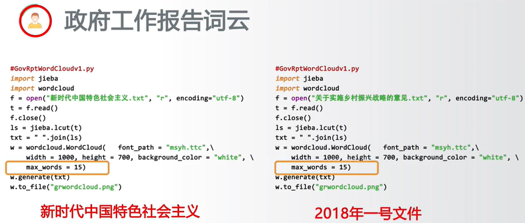
我们希望输出的词云是一个五角星的形状


扩展能力

- 了解 wordcloud 更多参数,扩展词云能力
- 特色词云:设计一款属于自己的特色词云风格
- 更多文件:用更多文件练习词云生成

## 第 8 周 程序设计方法学

### 第 8 周课程导学

#### 数字类型及操作

- **整数类型**: 无限范围及 4 种进制表示
- **浮点数类型**: 近似无限范围,小尾数及科学计数法
- **操作符**: +,-,\*,/,//,%,\*\*,二元增强赋值操作符
- **函数**: `abs()`, `divmod()`, `pow()`, `round()`, `max()`, `min()`, `int()`, `float()`, `complex()`

#### 字符串类型及操作

- **索引**: 正向递增序号,反向递减序号,`<字符串>[M:N:K]`
- **操作符和函数**: +,\*,`len()`, `str()`, `hex()`, `oct()`, `ord()`, `chr()`
- **字符串方法**: `.lower()`, `.upper()`, `.split()`, `.count()`, `.replace()`, `.center()`, `.strip()`, `join()`, `.format()` (格式化)

#### 程序的分支结构

- **if 结构**: 单分支 if,二分支 if-else 及紧凑形式
- **多分支结构**: if-elif-else 及条件之间关系
- **逻辑操作符**: not, and, or, >, >=, ==, <=, <
- **异常处理**: try-except-else-finally

#### 程序的循环结构

- **for 循环**: for..in 遍历循环:计数,字符串,列表,文件等
- **while 循环**: 无限循环
- **循环控制**: continue 和 break 保留字:退出当前循环层次
- **循环 else**: 循环 else 的高级用法:与 break 有关

#### 函数的定义与使用

- **定义函数**: 使用保留字 def 定义函数,lambda 定义匿名函数
- **参数类型**: 可选参数(赋初值),可变参数(`*b`),名称传递
- **返回和作用域**: 保留字 return 可以返回任意多个结果, 保留字 global 声明使用全局变量,一些隐式规则

#### 代码复用与函数递归

- **模块化设计**: 松耦合,紧耦合
- **函数递归**: 函数递归的 2 个特征:基例和链条
- **实现**: 函数递归的实现:函数+分支结构

#### 集合类型及操作

- **集合创建**: 使用{}和`set()`函数创建
- **集合操作**: 交(&),并(|),差(-),补(^),比较(>=<)
- **集合方法**: `.add()`, `.discard()`, `.pop()`等
- **应用**: 集合类型主要应用于:包含关系比较,数据去重

#### 序列类型及操作

- **概念**: 序列是基类类型,扩展类型包括:字符串,元组和列表
- **创建和操作**: 元组用()和`tuple()`创建,列表用`[]`和`list()`创建
- **元组操作**: 元组操作与序列操作基本相同
- **列表操作**: 列表操作在序列操作基础上增加了更多的灵活性

#### 字典类型及操作

- **映射关系**: 映射关系采用键值对表达
- **创建和索引**: 字典类型使用{}和`dict()`创建,键值对之间用`:`分隔
- **索引和赋值**: `d[key]`方式既可以索引,也可以赋值
- **方法和函数**: 字典类型有一批操作方法和函数,最重要的是`.get()`

#### 文件的使用

- **操作流程**: 文件的使用方式:打开-操作-关闭
- **文件类型**: 文本文件&二进制文件,`open()`和`.close()`
- **文件读取**: 文件内容的读取:`.read()`, `.readline()`, `.readlines()`
- **数据写入**: 数据的文件写入:`write()`, `.writelines()`, `.seek()`

#### 一维数据的格式化和处理

- **数据维度**: 数据的维度:一维,二维,多维,高维
- **数据表示**: 一维数据的表示:列表类型(有序)和集合类型(无序)
- **数据存储**: 一维数据的存储:空格分隔,逗号分隔,特殊符号分隔
- **数据处理**: 一维数据的处理:字符串方法`.split()`和`.join()`

#### 二维数据的格式化和处理

- **数据表示**: 二维数据的表示:列表类型,其中每个元素也是一个列表
- **CSV 格式**: CSV 格式:逗号分隔表示一维,按行分隔表示二维
- **数据处理**: 二维数据的处理:for 循环+.split()和.join()

#### 第八章第一节:实例 13:体育竞技分析(自顶向下设计和自底向上执行)

#### 第八章第二节:Python 程序设计思维

#### 第八章第三节:Python 第三方库安装

#### 第八章第四节:模块 7:os 库的基本使用

#### 第八章第五节:实例 14:第三方库自动安装脚本

方法论

- 理解并掌握一批 Python 程序设计思维
  实践能力
- 学会编写更有设计感的程序

### 第 8 章第 1 节:实例 13:体育竞技问题分析

#### 体育竞技分析

#### 需求分析

分析体育竞技比赛,确定胜负往往在毫厘之间的差距.通过科学的方法预测比赛结果.

- **输入**: 球员的水平
- **输出**: 可预测的比赛成绩

高手过招,胜负只在**毫厘之间**.进行体育竞技分析,模拟 N 场比赛以获得更加科学的比赛结果分析.

#### 概念定义

- **毫厘**: 在体育竞技中,毫厘通常指极小的差距,可能决定比赛的胜负.在具体的数值分析中,毫厘可以指代球员技能,体能,心理等因素的微小差异.

#### 分析方法

1. **计算思维**: 采用抽象和自动化的方法来分析比赛.
2. **模拟比赛**:
   - **抽象比赛过程**: 设定比赛规则和球员参数,将实际比赛抽象成可计算的模型.
   - **自动化执行 N 场比赛**: 通过编程模拟多场比赛,收集数据进行分析.
   - **科学性**: 当模拟的场次 N 越大时,通过统计学的方法,比赛结果的分析会越接近真实比赛的概率分布,从而提高预测的科学性.

####比赛规则

- **双人击球比赛**: 参与者为 A 和 B,采用回合制,5 局 3 胜.
  - **发球规则**: 开始时一方先发球,直至判分,接下来胜者发球.
  - **得分规则**: 球员只能在自己的发球局得分,先达到 15 分者胜一局.

通过上述方法,可以科学地分析体育竞技比赛,预测比赛结果,并深入理解体育竞技中"毫厘"的重要性.

#### 方法论

#### 自顶向下 (Top-Down Approach)

自顶向下是解决复杂问题的一种有效方法,它包括以下步骤:

1. **问题分解**:

   - 将一个总问题表达为若干个小问题组成的形式.
   - 使用同样的方法进一步分解小问题.

2. **逐步细化**:
   - 继续分解,直至小问题可以用计算机简单明了地解决.

这种方法强调从最广泛的视角开始分析问题,逐步细化到具体的操作和解决方案.

#### 自底向上 (Bottom-Up Approach)

自底向上是逐步组建复杂系统的一种有效测试方法,其特点包括:

1. **模块独立开发**:

   - 在自底向上的设计中,各个模块被独立开发和测试.

2. **单独测试**:

   - 开发模块后,首先对各个模块进行单独测试.

3. **逐步集成**:
   - 在各个模块测试通过后,将这些模块逐步集成形成完整的系统.

这种方法强调从具体的单元开始,逐渐构建并集成成完整的系统或解决方案.

两种方法各有优势,根据实际情况选择适合的方法论是解决问题和系统开发的关键.

#### 程序总体框架及步骤

- 步骤 1:打印程序的介绍性信息式
- 步骤 2:获得程序运行参数:proA,proB,n
- 步骤 3:利用球员 A 和 B 的能力值,模拟 n 局比赛
- 步骤 4:输出球员 A 和 B 获胜比赛的场次及概率
- printInfo()
- getinputs()
- simNGames()
- printSummary()

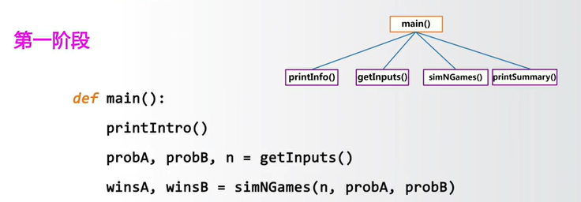

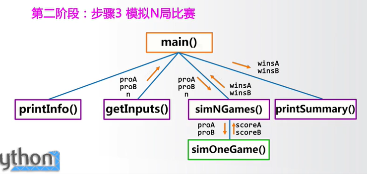

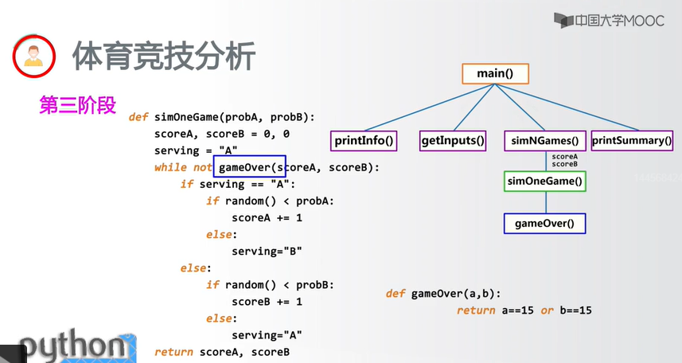

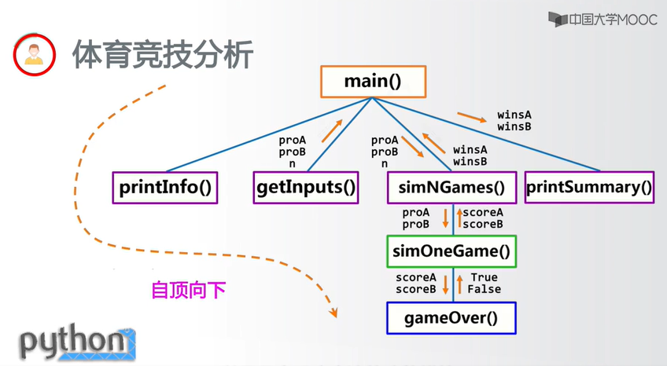

```python
这个程序模拟两个选手A和B的某种竞技比赛
程序运行需要A和B的能力值(以0到1之间的小数表示)
请输入选手A的能力值(0-1):0.45
请输入选手B的能力值(0-1):0.50
模拟比赛的场次:1000
竞技分析开始,共模拟1000场比赛
选手A获胜365场比赛,占比36.5%
选手B获胜635场比赛,占比63.5%
```

能力值:0.45 v.s. 0.50
获胜数:36.5% v.s. 63.5%

应用问题的扩展

- 扩展比赛参数,增加对更多能力对比情况的判断
- 扩展比赛设计,增加对真实比赛结果的预测
- 扩展分析逻辑,反向推理,用胜率推算能力?

### 第 8 章第 2 节:Python 程序设计思维

- 计算思维与程序设计
- 计算生态与 Python 语言
- 用户体验与软件产品
- 基本的程序设计模式

#### 计算思维与程序设计

第 3 种人类思维特征

- 逻辑思维:推理和演绎,数学为代表,A->B,B->C,A->C
- 实证思维:实验和验证,物理为代表,引力波<-实验
- 计算思维:设计和构造,计算机为代表,汉诺塔递归

抽象和自动化

- 计算思维:Computational Thinking
- 抽象问题的计算过程,利用计算机自动化求解
- 计算思维是基于计算机的思维方式

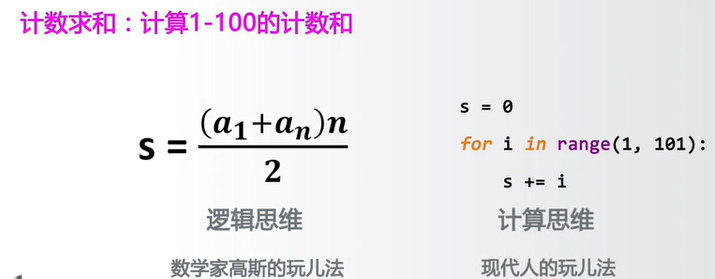
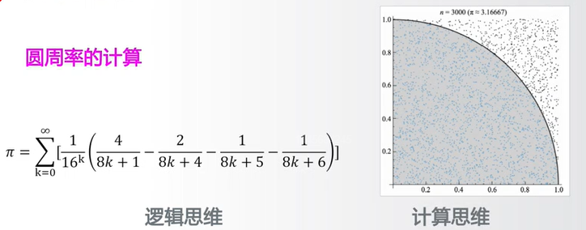
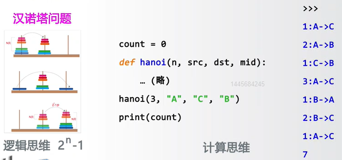
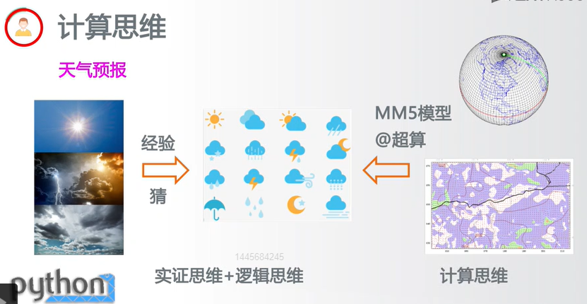


计算思维

抽象问题的计算过程,利用计算机自动化求解

- 计算思维基于计算机强大的算力及海量数据
- 抽象计算过程,关注设计和构造,而非因果
- 以计算机程序设计为实现的主要手段


#### 计算生态与 Python 语言

计算生态以开源项目为组织形式,充分利用共识原则"和"社会利他"组织人员,在竞争发展,相互依存和迅速更选中完成信息技术的更新换代,形成了技术的自我演化路径.

以开源项目为代表的大量第三方库

- Python 语言提供>15 万个第三方库
  库的建设经过野蛮生长和自然选择
- 同一个功能,Python 语言 2 个以上第三方库
- 库之间相互关联使用,依存发展
- Python 库间广泛联系,逐级封装
- 社区庞大,新技术更选迅速
- AlphaGo 深度学习算法采用 Python 语言开源

API(应用程序编写接口)!=生态

创新:跟随创新,集成创新,原始创新

- 加速科技类应用创新的重要支撑
- 发展科技产品商业价值的重要模式
- 国家科技体系安全和稳固的基础

刀耕火种->站在巨人的肩膀上

- 编程的起点不是算法而是系统
- 编程如同搭积木,利用计算生态为主要模式
- 编程的目标是快速解决问题

#### 用户体验与软件产品

实现功能-关注体验

- 用户体验指用户对产品建立的主观感受和认识
- 关心功能实现,更要关心用户体验,才能做出好产品
- 编程只是手段,不是目的,程序最终为人类服务

方法 1:进度展示

- 如果程序需要计算时间,可能产生等待,请增加进度展示
- 如果程序有若干步骤,需要提示用户,请增加进度展示
- 如果程序可能存在大量次数的循环,请增加进度展示

方法 2:异常处理

- 当获得用户输入,对合规性需要检查,需要异常处理
- 当读写文件时,对结果进行判断,需要异常处理
- 当进行输入输出时,对运算结果进行判断,需要异常处理

其他类方法

- 打印输出:特定位置,输出程序运行的过程信息
- 日志文件:对程序异常及用户使用进行定期记录
- 帮助信息:给用户多种方式提供帮助信息
- 软件程序->软件产品
- 用户体验是程序到产品的关键环节

#### 基本的程序设计模式

从 IPO 开始...

- I:input 输入,程序的输入
- P:Process 处理,程序的主要逻辑
- O:Output 输出,程序的输出
- 确定 IPO:明确计算部分及功能边界
- 编写程序:将计算求解的设计变成现实
- 调试程序:确保程序按照正确逻辑能够正确运行

模块化设计

- 通过函数或对象封装将程序划分为模块及模块间的表达
- 具体包括:主程序,子程序和子程序间关系
- 分而治之:一种分而治之,分层抽象,体系化的设计思想
- 紧耦合:两个部分之间交流很多,无法独立存在
- 松耦合:两个部分之间交流较少,可以独立存在
- 模块内部紧耦合,模块之间松耦合

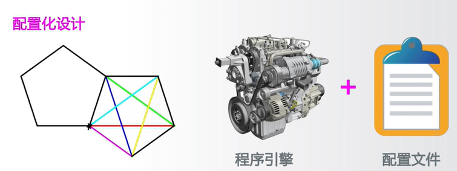

- 引擎+配置:程序执行和配置分离,将可选参数配置化
- 将程序开发变成配置文件编写,扩展功能而不修改程序
- 关键在于接口设计,清晰明了,灵活可扩展

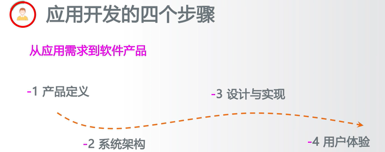

从应用需求到软件产品

- 1 产品定义:对应用需求充分理解和明确定义
  产品定义,而不仅是功能定义,要考虑商业模式
- 2 系统架构:以系统方式思考产品的技术实现
  系统架构,关注数据流,模块化,体系架构
- 3 设计与实现:结合架构完成关键设计及系统实现
  结合可扩展性,灵活性等进行设计优化
- 4 用户体验:从用户角度思考应用效果
  用户至上,体验优先,以用户为中心

https://pypi.org/

实例:开发与区块链相关的程序

- 第 1 步:在 pypi.org 搜索 blockchain
- 第 2 步:挑选适合开发目标的第三方库作为基础
- 第 3 步:完成自己需要的功能
  pip 命令
- pip install X
- pip uninstall X
- pip search X
- pip show X

Python 数据处理方面的集成开发工具 Anaconda

- 支持近 800 个第三方库
- 包含多个主流工具
- 适合数据计算领域开发

#### 文件安装方法

为什么有些第三方库用 pip 可以下载,但无法安装?

- 某些第三方库 pip 下载后,需要编译再安装
- 如果操作系统没有编译环境,则能下载但不能安装
- 可以直接下载编译后的版本用于安装吗?

http://www.lfd.uci.edu/~gohlke/pythonlibs/

#### OS 库

Os 库提供通用的,基本的操作系统交互功能

- 路径操作:os.path 子库,处理文件路径及信息
- 进程管理:启动系统中其他程序
- 环境参数:获得系统软硬件信息等环境参数

#### OS Path 函数

`os.path` 模块在 Python 中用于常见的路径名操作.

#### 函数描述

1. **os.path.abspath(path)**

   - **描述**: 返回给定路径在当前系统中的绝对路径.
   - **示例**:
     ```python
     os.path.abspath("file.txt")  # 输出: 'c:/Users//Tian Song//Python36-321//file.txt'
     ```

2. **os.path.normpath(path)**

   - **描述**: 规范化路径表示,使用反斜杠 (`\`) 分隔路径.
   - **示例**:
     ```python
     os.path.normpath("D://PYE//file.txt")  # 输出: 'D:\PYE\file.txt'
     ```

3. **os.path.relpath(path)**

   - **描述**: 返回从当前程序到文件的相对路径.
   - **示例**:
     ```python
     os.path.relpath("c://PYE//file.txt")  # 输出: '..\..\..\..\PYE\file.txt'
     ```

4. **os.path.dirname(path)**

   - **描述**: 返回给定路径的目录名称.
   - **示例**:
     ```python
     os.path.dirname("D://PYE//file.txt")  # 输出: 'D://PYE'
     ```

5. **os.path.basename(path)**

   - **描述**: 返回路径的基本名称,即路径的最后一部分.
   - **示例**:
     ```python
     os.path.basename("D://PYE//file.txt")  # 输出: 'file.txt'
     ```

6. **os.path.join(path, \*paths)**

   - **描述**: 将多个路径组件合并成一个路径.
   - **示例**:
     ```python
     os.path.join("D:/", "PYE/file.txt")  # 输出: 'D:/PYE/file.txt'
     ```

7. **os.path.exists(path)**

   - **描述**: 检查给定的路径是否存在.
   - **示例**:
     ```python
     os.path.exists("D://PYE//file.txt")  # 输出: False
     ```

8. **os.path.isfile(path)**

   - **描述**: 检查给定的路径是否为现有文件.
   - **示例**:
     ```python
     os.path.isfile("D://PYE//file.txt")  # 输出: True
     ```

9. **os.path.isdir(path)**

   - **描述**: 检查给定的路径是否为现有目录.
   - **示例**:
     ```python
     os.path.isdir("D://PYE//file.txt")  # 输出: False
     ```

10. **os.path.getatime(path)**

    - **描述**: 返回给定路径的文件或目录的最后访问时间.
    - **示例**:
      ```python
      os.path.getatime("D:/PYE/file.txt")
      ```

11. **os.path.getmtime(path)**

    - **描述**: 返回给定路径的文件或目录的最后修改时间.
    - **示例**:
      ```python
      os.path.getmtime("D:/PYE/file.txt")
      ```

12. **os.path.getctime(path)**

    - **描述**: 返回给定路径的文件或目录的创建时间.
    - **示例**:
      ```python
      time.ctime(os.path.getctime("D:/PYE/file.txt"))
      ```

13. **os.path.getsize(path)**
    - **描述**: 返回文件的大小,以字节为单位.
    - **示例**:
      ```python
      os.path.getsize("D:/PYE/file.txt")
      ```

#### 进程管理

os.system(command)

- 执行程序或命令 command
- 在 Windows 系统中,返回值为 cmd 的调用返回信息

```python
import os
os.system("c://windows//system32//calc.exe")

importos
os.system("c://windows//system32//mspaint.exe / D:/\PYECourse//grwordcloud.png")
```

#### OS 模块函数

`os` 模块在 Python 中提供了一种使用与操作系统相关的功能的方法.

##### 函数描述

1. **os.chdir(path)**

   - **描述**: 修改当前程序操作的路径.
   - **示例**:
     ```python
     os.chdir("D:")
     ```

2. **os.getcwd()**

   - **描述**: 返回程序的当前路径.
   - **示例**:
     ```python
     os.getcwd()  # 输出: "D:\\"
     ```

3. **os.getlogin()**

   - **描述**: 获取当前系统登录用户名称.
   - **示例**:
     ```python
     os.getlogin()  # 输出: "Tian Song"
     ```

4. **os.cpu_count()**

   - **描述**: 获得当前系统的 CPU 数量.
   - **示例**:
     ```python
     os.cpu_count()
     ```

5. **os.urandom(n)**
   - **描述**: 获得 n 个字节长度的随机字符串,通常用于加解密运算.
   - **示例**:
     ```python
     os.urandom(10)  # 输出: b'7/xbe|xf2/\xc1=|xe1gL1xb3'
     ```

可以使用这个 Markdown 内容清晰,结构化地记录 `os` 模块的功能.

### 第 8 章第 5 节:第三方库自动安装脚本

| 库名           | 用途                           | pip 安装指令                 |
| -------------- | ------------------------------ | ---------------------------- |
| NumPy          | N 维数据表示和运算             | `pip install numpy`          |
| Matplotlib     | 二维数据可视化                 | `pip install matplotlib`     |
| PIL (Pillow)   | 图像处理                       | `pip install pillow`         |
| Scikit-Learn   | 机器学习和数据挖掘             | `pip install sklearn`        |
| Requests       | HTTP 协议访问及网络爬虫        | `pip install requests`       |
| Jieba          | 中文分词                       | `pip install jieba`          |
| Beautiful Soup | HTML 和 XML 解析器             | `pip install beautifulsoup4` |
| Wheel          | Python 第三方库文件打包工具    | `pip install wheel`          |
| PyInstaller    | 打包 Python 源文件为可执行文件 | `pip install pyinstaller`    |
| Django         | Python 最流行的 Web 开发框架   | `pip install django`         |
| Flask          | 轻量级 Web 开发框架            | `pip install flask`          |
| WeRoBot        | 微信机器人开发框架             | `pip install werobot`        |
| SymPy          | 数学符号计算工具               | `pip install sympy`          |
| Pandas         | 高效数据分析和计算             | `pip install pandas`         |
| Networkx       | 复杂网络和图结构的建模和分析   | `pip install networkx`       |
| PyQt5          | 基于 Qt 的专业级 GUI 开发框架  | `pip install pyqt5`          |
| PyOpenGL       | 多平台 OpenGL 开发接口         | `pip install pyopengl`       |
| PyPDF2         | PDF 文件内容提取及处理         | `pip install pypdf2`         |
| docopt         | Python 命令行解析              | `pip install docopt`         |
| PyGame         | 简单小游戏开发框架             | `pip install pygame`         |

#### 自动化脚本+

- 编写各类自动化运行程序的脚本,调用已有程序
- 扩展应用:安装更多第三方库,增加配置文件
- 扩展异常检测:捕获更多异常类型,程序更稳定友好

## 第 9 周:Python 计算生态体系

### 第 9 周课程导学

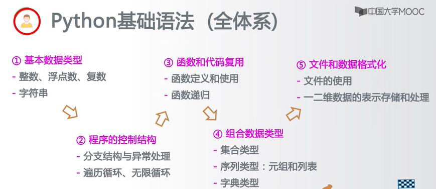

- 计算思维:抽象计算过程和自动化执行
- 计算生态:竞争发展,相互依存,快速更送
- 用户体验:进度展示,异常处理等
- IPO,自顶向下,模块化,配置化,应用开发的四个步骤
- PyPI : Python Package Index
- pip 命令的各种用法
- Anaconda 集成开发工具及安装方法
- UCI 页面的"补丁"安装方法
- 9.1 从数据处理到人工智能
- 9.2 实例 15:霍兰德人格分析雷达图
- 9.3 从 Web 解析到网络空间
- 9.4 从人机交互到艺术设计
- 9.5 实例 16:玫瑰花绘制
  方法论
- 纵览 Python 计算生态,看见更大的世界
  实践能力
- 初步编写带有计算生态的复杂程序

### 第 9 周第 1 节从数据处理到人工智能

#### 数据分析流程及相关 Python 库

数据分析流程包括数据表示,数据清洗,数据统计,数据可视化,数据挖掘和人工智能.以下是各个阶段的简要描述以及相关的 Python 库介绍.

#### 数据表示

- **定义**:采用合适的方式用程序表达数据.

#### 数据清洗

- **定义**:包括数据归一化,数据转换,异常值处理等.

#### 数据统计

- **定义**:对数据的概要理解,包括数量,分布,中位数等统计特性.

#### 数据可视化

- **定义**:直观展示数据内涵的方式.

#### 数据挖掘

- **定义**:从数据分析获得知识,产生数据外的价值.

#### 人工智能

- **定义**:在数据,语言,图像,视觉等方面进行深度分析与决策.

#### Python 库介绍

#### Numpy

- **简介**:表达 N 维数组的最基础库.
- **特点**:
  - Python 接口使用,C 语言实现,计算速度优异.
  - Python 数据分析及科学计算的基础库,支撑 Pandas 等.
  - 提供直接的矩阵运算,广播函数,线性代数等功能.
- **官网**:[Numpy](https://www.numpy.org)

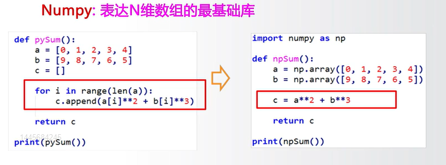

#### Pandas

- **简介**:Python 数据分析高层次应用库.
- **特点**:
  - 提供了简单易用的数据结构和数据分析工具.
  - 理解数据类型与索引的关系,操作索引即操作数据.
  - Python 最主要的数据分析功能库,基于 Numpy 开发.
- **核心结构**:
  - `Series` = 索引 + 一维数据
  - `DataFrame` = 行列索引 + 二维数据.
- **官网**:[Pandas](http://pandas.pydata.org)

#### SciPy

- **简介**:数学,科学和工程计算功能库.
- **特点**:
  - 提供了一批数学算法及工程数据运算功能.
  - 类似 Matlab,可用于如傅里叶变换,信号处理等应用.
  - Python 最主要的科学计算功能库,基于 Numpy 开发.
- **官网**:[SciPy](http://www.scipy.org)

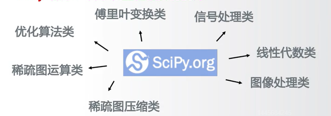

#### 数据可视化

数据可视化是数据分析过程中的关键一步,它使得抽象和复杂的数据以直观,易理解的方式呈现.以下是一些常用的 Python 数据可视化库.

#### Matplotlib

- **简介**:高质量的二维数据可视化功能库.
- **特点**:
  - 提供了超过 100 种数据可视化展示效果.
  - 通过`matplotlib.pyplot`子库调用各可视化效果.
  - Python 最主要的数据可视化功能库,基于 Numpy 开发.
- **官网**:[Matplotlib](http://matplotlib.org)

#### Seaborn

- **简介**:统计类数据可视化功能库.
- **特点**:
  - 提供了一批高层次的统计类数据可视化展示效果.
  - 主要展示数据间的分布,分类和线性关系等内容.
  - 基于 Matplotlib 开发,支持 Numpy 和 Pandas.
- **官网**:[Seaborn](http://seaborn.pydata.org/)

#### Mayavi

- **简介**:三维科学数据可视化功能库.
- **特点**:
  - 提供了一批简单易用的 3D 科学计算数据可视化展示效果.
  - 目前版本是 Mayavi2,为三维可视化领域主要的第三方库.
  - 支持 Numpy,TVTK,Traits,Envisage 等第三方库.
- **官网**:[Mayavi](http://docs.enthought.com/mayavi/mayavi/)

#### 文本处理

#### PyPDF2

- **简介**:用来处理 PDF 文件的工具集.
- **特点**:
  - 提供了一批处理 PDF 文件的计算功能.
  - 支持获取信息,分隔/整合文件,加密解密等.
  - 完全 Python 语言实现,不需要额外依赖,功能稳定.
- **示例代码**:
  ```python
  from PyPDF2 import PdfFileReader, PdfFileMerger
  merger = PdfFileMerger()
  input1 = open("document1.pdf", "rb")
  input2 = open("document2.pdf", "rb")
  merger.append(fileobj=input1, pages=(0,3))  # 注意这里是数字0,不是字母o
  merger.merge(position=2, fileobj=input2, pages=(0,1))  # 注意这里是数字0,不是字母o
  output = open("document-output.pdf", "wb")
  merger.write(output)
  ```
- **官网**:[Mayavi](http://mstamy2.github.io/PyPDF2)

#### NLTK

- **简介**:自然语言文本处理第三方库.
- **特点**:
  - 提供了一批简单易用的自然语言文本处理功能.
  - 支持语言文本分类,标记,语法句法,语义分析等.
  - 被广泛认为是最优秀的 Python 自然语言处理库之一.
- **示例代码**:
  ```python
  from nltk.corpus import treebank
  t = treebank.parsed_sents('wsj_001.mrg')[0]  # 注意文件名中是数字0,不是字母o
  t.draw()
  ```
- **官网**:[NLTK](http://www.nltk.org/)
  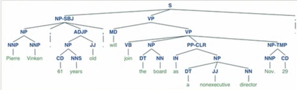

#### Python-docx

- **简介**:创建或更新 Microsoft Word 文件的第三方库.
- **特点**:
  - 提供创建或更新`.doc`,`.docx`等文件的计算功能.
  - 允许增加并配置段落,图片,表格,文字等,功能全面.
- **示例代码**:
  ```python
  from docx import Document
  document = Document()
  document.add_heading('Document Title', 0)
  p = document.add_paragraph('A plain paragraph having some ')
  document.add_page_break()
  document.save('demo.docx')
  ```
- **官网**:[Python-docx](http://python-docx.readthedocs.io/en/latest/index.html)

#### 机器学习

#### Scikit-learn

- **简介**:机器学习方法工具集.
- **特点**:
  - 提供一批统一化的机器学习方法功能接口.
  - 提供聚类,分类,回归,强化学习等计算功能.
  - 被广泛认为是机器学习领域最基本且最优秀的 Python 第三方库.
- **官网**:[Scikit-learn](http://scikit-learn.org/)

#### TensorFlow

- **简介**:AlphaGo 背后的机器学习计算框架.
- **特点**:
  - 谷歌公司推动的开源机器学习框架.
  - 将数据流图作为基础,图节点代表运算,边代表张量.
  - 支撑谷歌人工智能应用的一种机器学习方法.
- **示例代码**:
  ```python
  import tensorflow as tf
  init = tf.global_variables_initializer()
  sess = tf.Session()
  sess.run(init)
  res = sess.run(result)
  print('result:', res)
  ```
- **官网**:[tensorflow](https://www.tensorflow.org/)

#### MXNet

- **简介**:基于神经网络的深度学习计算框架.
- **特点**:
  - 提供可扩展的神经网络及深度学习计算功能.
  - 可用于自动驾驶,机器翻译,语音识别等众多领域.
  - 被广泛认为是 Python 领域最重要的深度学习计算框架之一.
- **官网**:[MXNet](https://mxnet.incubator.apache.org/)

#### 小结

- Numpy,Pandas,SciPy
- Matplotlib,Seaborn,Mayavi
- PyPDF2,NLTK,python-docX
- Scikit-learn,TensorFlow,MXNet

### 第 9 周第 2 节"霍兰德人格分析雷达图"问题分析

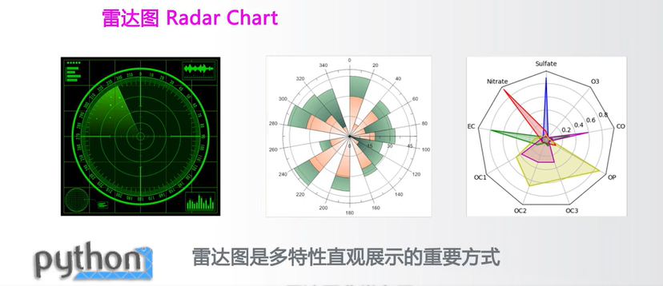

#### 霍兰德人格分析

霍兰德认为人格兴趣与职业之间应有一种内在的对应关系.

#### 人格分类:

- 研究型
- 艺术型
- 社会型
- 企业型
- 传统型
- 现实性

#### 职业示例:

- 工程师(现实性)
- 实验员(研究型)
- 艺术家(艺术型)
- 推销员(企业型)
- 记事员(传统型)
- 社会工作者(社会型)

#### 霍兰德人格分析雷达图

雷达图可以用于验证霍兰德人格分析,通过显示各职业人群结合兴趣的调研数据.

#### 需求:

- **输入**:各职业人群结合兴趣的调研数据.
- **输出**:雷达图显示六个人格维度的数据.

#### 工具:

- **通用雷达图绘制**:使用 matplotlib 库.
- **专业的多维数据表示**:使用 numpy 库.

雷达图可以直观地展示不同职业人群在六个人格维度上的特点和差异.

### 第 9 周第 3 节:从 web 解析到网络空间

- Python 库之网络爬虫
- Python 库之 Web 信息提取
- Python 库之 Web 网站开发
- Python 库之网络应用开发

#### 网络爬虫

Requests:最友好的网络爬虫功能库

- 提供了简单易用的类 HTTP 协议网络爬虫功能
- 支持连接池,SSL,Cookies,HTTP(S)代理等
- Python 最主要的页面级网络爬虫功能库

```python
import requests

# Set the endpoint and authentication credentials
url = "https://api.github.com/user"
auth_credentials = ('user', 'pass')

# Make the GET request
response = requests.get(url, auth=auth_credentials)

# Print the status code
print("Status Code:", response.status_code)

# Print the content type from headers
print("Content-Type:", response.headers['content-type'])

# Print the encoding
print("Encoding:", response.encoding)

# Print the response text (body)
print("Response Text:", response.text)
```

http://www.python-requests.org/

Scrapy:优秀的网络爬虫框架

- 提供了构建网络爬虫系统的框架功能,功能半成品
- 支持批量和定时网页爬取,提供数据处理流程等
- Python 最主要且最专业的网络爬虫框架

https://scrapy.org

pyspider:强大的 Web 页面爬取系统

- 提供了完整的网页爬取系统构建功能
- 支持数据库后端,消息队列,优先级,分布式架构等
- Python 重要的网络爬虫类第三方库

http://docs.pyspider.org

#### web 信息提取

#### Beautiful Soup

- **简介**:HTML 和 XML 的解析库.
- **特点**:
  - 提供了解析 HTML 和 XML 等 Web 信息的功能.
  - 又名 beautifulsoup4 或 bs4,可以加载多种解析引擎.
  - 常与网络爬虫库搭配使用,如 Scrapy,requests 等.
- **官网**:[Beautiful Soup](https://www.crummy.com/software/BeautifulSoup/bs4)
  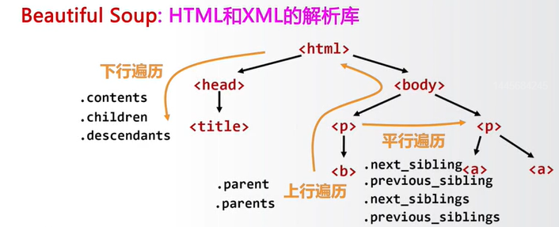

#### Re (正则表达式库)

- **简介**:正则表达式解析和处理功能库.
- **特点**:
  - 提供了定义和解析正则表达式的一批通用功能.
  - 可用于各类场景,包括定点的 Web 信息提取.
  - Python 最主要的标准库之一,无需安装.
- **示例函数**:
  - `re.search()`
  - `re.split()`
  - `re.match()`
  - `re.finditer()`
  - `re.findall()`
  - `re.sub()`
  - 正则表达式示例:`r'\d{3}-\d{8}|\d{4}-\d{7}'`
- **官网**:[Re - Regular Expressions](https://docs.python.org/3.6/library/re.html)

#### Python-Goose

- **简介**:提取文章类型 Web 页面的功能库.
- **特点**:
  - 提供了对 Web 页面中文章信息,视频等元数据的提取功能.
  - 针对特定类型 Web 页面,应用覆盖面较广.
  - 被认为是 Python 最主要的 Web 信息提取库之一.
- **示例代码**:
  ```python
  from goose import Goose
  url = "http://www.elmundo.es/elmundo/2012/10/28/espana/1351388909.html"
  g = Goose({'use_meta_language': False, 'target_language': 'es'})
  article = g.extract(url=url)
  print(article.cleaned_text[:150])
  ```
- **官网**:[python-goose](https://github.com/grangier/python-goose)

#### web 网站开发

#### Django

- **简介**:最流行的 Web 应用框架.
- **特点**:
  - 提供了构建 Web 系统的基本应用框架.
  - 遵循 MTV 模式:模型(Model),模板(Template),视图(Views).
  - Python 最重要的 Web 应用框架,适用于略微复杂的应用框架.
- **示意图**:
  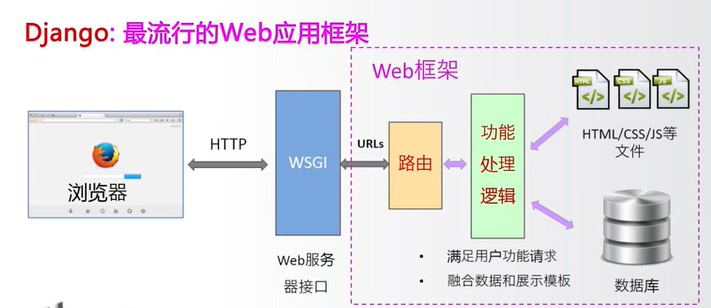

#### Pyramid

- **简介**:规模适中的 Web 应用框架.
- **特点**:
  - 提供了简单方便构建 Web 系统的应用框架.
  - 不大不小,规模适中,适合快速构建并适度扩展的类应用.
  - Python 产品级 Web 应用框架,起步简单可扩展性好.
- **官网**:[Pyramid](https://trypyramid.com/)

#### Flask

- **简介**:Web 应用开发微框架.
- **特点**:
  - 提供了最简单构建 Web 系统的应用框架.
  - 特点是:简单,规模小,快速.
  - 在复杂性和灵活性方面,Django > Pyramid > Flask.
- **官网**:[Flask](http://flask.pocoo.org)

#### 网络应用开发

#### 微信公众号开发框架:WeRoBot

- **功能**:提供了解析微信服务器消息及反馈消息的功能,是建立微信机器人的重要技术手段.
- **GitHub 地址**:[WeRoBot](https://github.com/offu/WeRoBot)

#### 百度 AI 开放平台接口:aip

- **功能**:提供了访问百度 AI 服务的 Python 功能接口.涵盖语音,人脸,OCR,NLP,知识图谱,图像搜索等领域.
- **主要用途**:Python 百度 AI 应用的最主要方式.
- **GitHub 地址**:[百度 AI 开放平台接口](https://github.com/Baidu-AIP/python-sdk)


#### 二维码生成第三方库:MyQR

- **功能**:提供了生成二维码的系列功能,包括基本二维码,艺术二维码和动态二维码.
- **GitHub 地址**:[MyQR](https://github.com/sylnsfar/qrcode)


#### 单选小结

- Requests,Scrapy,pyspider
- Beautiful Soup,Re,Python-Goose
- Django,Pyramid,Flask
- WeRobot,aip,MyQR

### 第 9 周第 4 节 从人机交互到艺术设计

#### 单元开篇

- Python 库之图形用户界面
- Python 库之游戏开发
- Python 库之虚拟现实
- Python 库之图形艺术

#### Python 库之图形用户界面

#### Python GUI 开发框架

### PyQt5:Qt 开发框架的 Python 接口

- **功能**:提供了创建 Qt5 程序的 Python API 接口.
- **特点**:Qt 是非常成熟的跨平台桌面应用开发系统,具有完备的 GUI 支持.
- **推荐**:作为 Python GUI 开发的推荐第三方库.
- **官网**:[PyQt5](https://www.riverbankcomputing.com/software/pyqt)

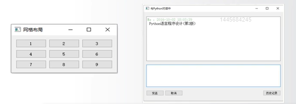

#### WxPython:跨平台 GUI 开发框架

- **功能**:提供了专用于 Python 的跨平台 GUI 开发框架.
- **特点**:提供了丰富的控件和工具,通过这些工具开发者可以创建功能丰富,外观美观,响应灵敏的桌面应用程序.
- **用途**:广泛应用于商业软件和内部项目,也适合于开发者快速制作原型和工具.
- **示例代码**:
  ```python
  import wx
  app = wx.App(False)
  frame = wx.Frame(None, wx.ID_ANY, "Hello World")
  frame.Show(True)
  app.MainLoop()
  ```


- **官网**:[WxPython](https://www.wxpython.org)

#### PyGObject:使用 GTK+ 开发 GUI 的功能库

- **功能**:提供了整合 GTK+,WebKitGTK+ 等库的功能.
- **特点**:GTK+ 是一个跨平台的用户图形界面(GUI)框架,通过 PyGObject,开发者可以在 Python 中使用这些功能丰富的库.
- **用途**:广泛应用于开发桌面应用程序,例如 Anaconda 就采用该库构建其 GUI.
- **示例代码**:
  ```python
  import gi
  gi.require_version("Gtk", "3.0")
  from gi.repository import Gtk
  window = Gtk.Window(title="Hello World")
  window.show()
  window.connect("destroy", Gtk.main_quit)
  Gtk.main()
  ```


- **官网**:[PyGObject](https://pygobject.readthedocs.io)

#### Python 库之游戏开发

#### Python 游戏开发库

#### PyGame:简单的游戏开发功能库

- **功能**:提供了基于 SDL 的简单游戏开发功能及实现引擎.能够理解游戏对外部输入的响应机制,及角色构建和交互机制.
- **用途**:Python 游戏入门最主要的第三方库.
- **官网**:[PyGame](http://www.pygame.org)


#### Panda3D:开源,跨平台的 3D 渲染和游戏开发库

- **功能**:一个 3D 游戏引擎,提供 Python 和 C++两种接口.支持很多先进特性:法线贴图,光泽贴图,卡通渲染等.
- **开发者**:由迪士尼和卡内基梅隆大学共同开发.
- **官网**:[Panda3D](http://www.panda3d.org)


#### cocos2d:构建 2D 游戏和图形界面交互式应用的框架

- **功能**:提供了基于 OpenGL 的游戏开发图形渲染功能.支持 GPU 加速,采用树形结构分层管理游戏对象类型.
- **用途**:适用于 2D 专业级游戏开发.
- **官网**:[cocos2d](http://python.cocos2d.org/)


#### Python 库之虚拟现实

#### VRZero:在树莓派上开发 VR 应用的 Python 库

- **功能**:提供大量与 VR 开发相关的功能.
- **特点**:针对树莓派的 VR 开发库,支持设备小型化,配置简单化.非常适合初学者实践 VR 开发及应用.
- **GitHub 地址**:[VRZero](https://github.com/WayneKeenan/python-vrzero)


#### pyovr:Oculus Rift 的 Python 开发接口

- **功能**:针对 Oculus VR 设备的 Python 开发库.
- **特点**:基于成熟的 VR 设备,提供全套文档,适用于工业级应用.
- **用途**:Python+虚拟现实领域探索的一种思路.
- **GitHub 地址**:[pyovr](https://github.com/cmbruns/pyovr)


#### Vizard:基于 Python 的通用 VR 开发引擎

- **功能**:专业的企业级虚拟现实开发引擎.
- **特点**:提供详细的官方文档.支持多种主流的 VR 硬件设备,具有一定通用性.
- **官网**:[Vizard](http://www.worldviz.com/vizard-virtual-reality-software)


#### Python 库之图形艺术

#### 图像处理和艺术库

#### Quads:迭代的艺术

- **功能**:对图片进行四分迭代,形成像素风艺术作品.
- **特点**:可以生成动图或静态图像,简单易用且具有很高的视觉吸引力.
- **示例**:


- **GitHub 地址**:[Quads](https://github.com/fogleman/Quads)

#### ascii_art:ASCII 艺术库

- **功能**:将普通图片转换为 ASCII 艺术风格.
- **特点**:输出可以是纯文本或彩色文本,也可以采用图片格式输出.
- **示例**:

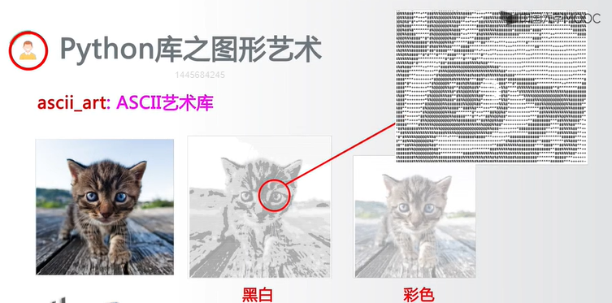

- **GitHub 地址**:[ascii_art](https://github.com/jontonsoup4/asci_art)

#### turtle:海龟绘图体系

- **描述**:Python 标准库中的一个绘图库,通过简单的命令和语法可以绘制各种图形.
- **特点**:适合于教学和简单图形程序的编写,支持事件驱动的程序设计.
- **示例**:


- **官网**:[turtle](https://docs.python.org/3/library/turtle.html)

以上是关于 Quads,ascii_art 和 turtle 三个不同的图像处理和艺术化库的介绍

#### 单元小结

- PyQt5,WxPython,PyGObject
- PyGame,Panda3D,cocos2d
- VR Zero,pyovr,Vizard
- Quads,asci_art,turtle

### 第 9 周第 5 节

玫瑰花绘制

- 需求:用 Python 绘制一朵玫瑰花,献给所思所念
- 输入:你的想象力!
- 输出:玫瑰花
- 绘制机理:turtle 基本图形绘制
- 绘制思想:因人而异
- 思想有多大,世界就有多大

艺术之于编程,设计之于编程

- 艺术:思想优先,编程是手段
- 设计:想法和编程同等重要
- 工程:编程优先,思想次之

编程不重要,思想才重要!

- 认识自己:明确自己的目标,有自己的思想(想法)
- 方式方法:编程只是手段,熟练之,未雨绸缪为思想服务
- 为谁编程:将自身发展与祖国发展相结合,创造真正价值

# 完结

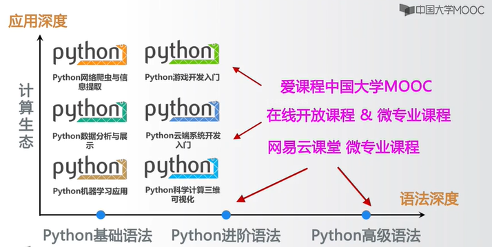
